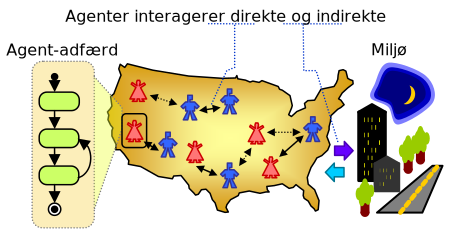

Hvad er en agent-baseret model?
===============================

Der er mange eksempler på ting i den virkelige verden, som er gavnlige
at kunne forudsige eller simulere: det kan for eksempel være
huspriser, sygdomsspredning eller selve vejret. For at kunne simulere
disse ting kan man bruge en *model*, der kan give en *approksimation*
af virkeligheden. Hvis man bruger en model til at simluere et
virkeligt fænomen, siges man derfor også at *modellere* fænomenet.

Eksempler på modeller:
 * `ADAM modellen <https://da.wikipedia.org/wiki/Annual_Danish_Aggregate_Model>`_, er en økonomisk model udviklet af Danmarks Statistik
   og anvendes af Finansministeriet til samfundsøkonomiske analyser.
 * `COVID-19 modellerne
   <https://covid19.ssi.dk/analyser-og-prognoser/modelberegninger>`_
   fra Statens Serum Institut's ekspertgruppe bruges til at afprøve
   forskellige genåbnings scenarier for pandemien, og estimere sygehusbelastning.

En model kan have mange former. nogle gange er det så simpelt som en
matematisk funktion; andre gange er det et helt computerprogram. En af
de slags modeller, der ofte findes som et computerprogram, kaldes en
**agent-baseret model**.

Se et eksempel på en agent-baseret model af evolution i denne Youtube video:

.. raw:: html

   

   <iframe width="560" height="315" src="https://www.youtube.com/embed/0ZGbIKd0XrM" frameborder="0" allow="accelerometer; autoplay; clipboard-write; encrypted-media; gyroscope; picture-in-picture" allowfullscreen></iframe>
   

Med en agent-baseret model forsøger man at modellere et fænomen, som
består af et miljø med mange, simple agenter. Agenterne behøver ikke
nødvendigvis at repræsentere mennesker, men kan også repræsentere for
eksempel elektroner i en ledning eller virksomheder der handler med
hinanden i en markedsøkonomi.

En agent-baseret model består typisk af følgende:
 - forskellige typer af agenter
 - et miljø, hvor agenter færdes
 - en beskrivelse af agenternes individuelle adfærd

Som det ses af følgende figur kan agenter både interagere direkte med
hinanden, eller indirekte med hinanden ved at interagere med det miljø de færdes i:
   

   *Illustration fra artiklen "Using AnyLogic and agent-based approach
   to model consumer market" af Garifullin et al. (2007)*

Kom godt i gang med at lave din første agent-baserede model:

 * :doc:`godtigang_mu`
 * :doc:`godtigang_thonny`

