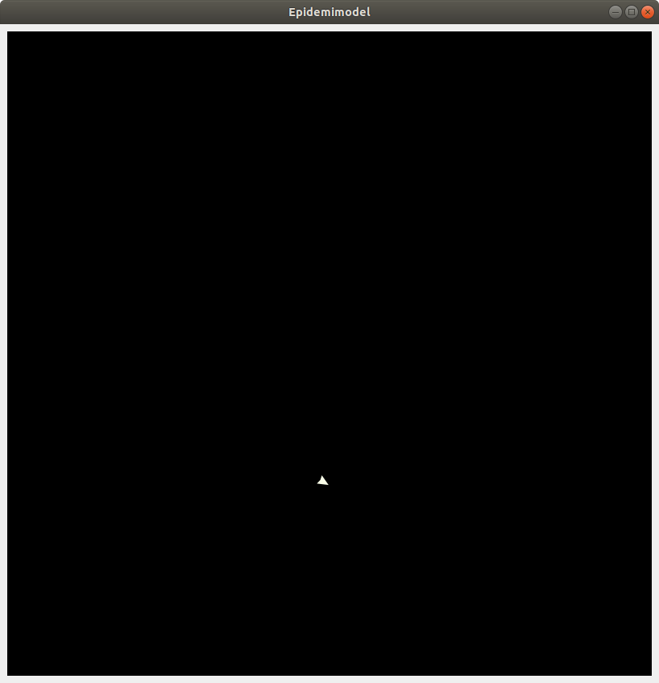

Del 1: Agenter i Python
=======================

Den første agent
----------------

Før vi begynder at lave agenter, der kan simulere smittespredning,
skal vi først have en *model*, vi kan have dem i. Begynd med at lave
en fil, kaldet ``epidemic.py``, og giv den følgende indhold::

  from agents import *

  epidemic_model = Model("Epidemi-model", 50, 50)

  run(epidemic_model)

Linje 1 gør sådan, at alle funktionaliteterne i biblioteket
``AgentsPy`` kan bruges i filen. Det er det bibliotek, der giver
adgang til alle de nødvendige funktioner.

Linje 3 laver en model med 50x50 felter (`tiles`), og navnet
`Epidemi-model`.

Linje 5 starter modellen.

Prøv at køre programmet, og se, hvad der sker. Der burde vises et
vindue af en sort firkant. Dette er en tom model.

Tilføj nu, på linje 4, følgende kode::

  min_agent = Agent()
  epidemic_model.add_agent(min_agent)

Disse to linjer laver en agent ved at bruge ``Agent()``, og tilføjer
den så til modellen ved at bruge ``add_agent()``. Starter man modellen
igen, burde der vises en enkelt lille trekant inde i modellen - dette
er agenten.

Knapper
-------
For at gøre det nemmere at styre vores model undervejs, vil vi gerne
tilføje nogle knapper til vinduet, som man kan klikke på for blandt
andet at starte og stoppe simulationen.

Lad os først tilføje en `setup` knap, som genstarter modellen. Indtil
videre skal den bare slette alle eksisterende agenter, og lave en ny.

Slet først de sidste to linjer, du tilføjede ovenfor (altså dem, der
laver en agent og tilføjer den til modellen). Tilføj så denne
funktion, lige efter, at du har importeret ``agents``::

  def setup(model):
      model.reset()
      model.add_agent(Agent())

Funktionen her sletter alle agenter med ``model.reset()`` og tilføjer
en ny med ``model.add_agent()``. Det kan virke lidt ligegyldigt nu,
men det vil blive brugbart senere.

Tilføj så, efter du har lavet ``epidemic_model``, følgende linje::

  epidemic_model.add_button("Setup", setup)

Linjen tilføjer en knap til vinduet som, når den klikkes på, kører
``setup``-funktionen.

Flere agenter
-------------
Lad os tilføje lidt flere agenter. Ændr ``setup`` funktionen, sådan at
den siger følgende::

  def setup(model):
      model.reset()
      for agent in range(100):
          model.add_agent(Agent())

Nu laver vi 100 agenter og tilføjer dem til modellen.

Lige nu laver agenterne ikke særlig meget. Lad os gøre det muligt for
agenterne at gå rundt omkring. Tilføj denne ``step`` funktion under
``setup`` funktionen::

  def step(model):
      for agent in model.agents:
          agent.direction += randint(-10,10)
          agent.forward()

Vi gennemgår funktionen:

- For hver agent i modellen:

  * Juster dens retning med en tilfældig vinkel mellem -10 og 10.
  * Ryk den et skridt fremad i den retning, den peger.

``randint(a,b)`` er en funktion, det vælger et tilfældigt tal mellem
``a`` og ``b``. For at bruge den, skal du lige importere den (gør
dette i toppen af filen, sammen med at du importerer ``agents``)::

  from random import randint

Slut af med at tilføje denne linje efter at du tilføjer `setup`-knappen::

  epidemic_model.add_button("Go", step, toggle=True)

Dette laver en knap, som man kan slå til og fra. Når den er slået til,
kører den ``step``-funktionen konstant, hvilket får agenterne til
at bevæge sig rundt.

Samlet kode
-----------
Her er den samlede kode du gerne skulle have nu::
  
  from agents import *
  from random import randint

  # Opret model
  epidemic_model = Model("Epidemi-model", 50, 50)

  # Reset model
  def setup(model):
      model.reset()
      for agent in range(100):
          model.add_agent(Agent())

  # Tag et skridt i modellen
  def step(model):
      for agent in model.agents:
          agent.direction += randint(-10,10)
          agent.forward()

  # Tilføj knapper til reset og go
  epidemic_model.add_button("Setup", setup)
  epidemic_model.add_button("Go", step, toggle=True)

  # Kør modellen
  run(epidemic_model)
