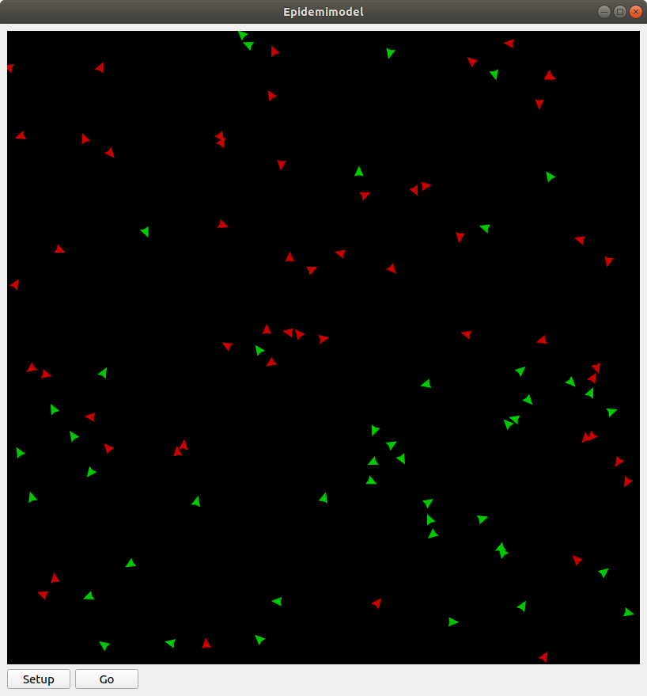

Del 1: En model over smittespredning
====================================

Tillykke! Du er, i midten af en verdensomspændende pandemi, netop
blevet ansat som den nye direktør for sundhedsstyrelsen. Regeringen
har givet dig din første opgave: forudsig, hvordan sygdommen spreder
sig, og kom med forslag, der kan mindske smittespredningen.

Du sidder længe og grubler over, hvordan du skal forudsige
spredningen, da en af dine kollegaer pludselig kommer med et godt
forslag. De foreslår, at du programmerer en *agent-baseret model*, som
kan simulere smittespredningen. På den måde kan du så bruge modellen
til at forudse, hvad der kommer til at ske i den virkelige verden. Du
tænker, at dette lyder som en fantastisk ide, og går straks i gang med
at kode en simpel model.

Den første agent
----------------

Før vi begynder at lave agenter, der kan simulere smittespredning,
skal vi først have en *model*, vi kan have dem i. Begynd med at lave
en fil, kaldet ``epidemic.py``, og giv den følgende indhold::

  from agents import *

  epidemic_model = Model("Epidemi-model", 100, 100)

  run(epidemic_model)

Linje 1 gør sådan, at alle funktionaliteterne i biblioteket
``AgentsPy`` kan bruges i filen. Det er det bibliotek, der giver
adgang til alle de nødvendige funktioner.

Linje 3 laver en model med 100x100 `tiles` (felter), og navnet
`Epidemi-model`.

Linje 5 starter modellen.

Prøv at køre programmet, og se, hvad der sker. Der burde vises et
vindue af en sort firkant. Dette er en tom model.

Tilføj nu, på linje 4, følgende kode::

  epidemic_model.add_agent(Agent())

Denne linje laver en agent ved at bruge ``Agent()``, og tilføjer
den så til modellen ved at bruge ``add_agent()``. Starter man
modellen igen, burde der vises en enkelt lille trekant inde i
modellen - dette er agenten.

.. image:: ../images/epidemic/epidemic-1.1.png
   :height: 400

Knapper
-------
For at gøre det nemmere at styre vores model undervejs, vil vi gerne
tilføje nogle knapper til vinduet, som man kan klikke på for blandt
andet at starte og stoppe simulationen. Lad os først tilføje en
`setup` knap, som genstarter modellen. Indtil videre skal den bare
slette alle eksisterende agenter, og lave en ny.

Slet først den linje, du lige har tilføjet ovenfor (altså den, der
laver en agent og tilføjer den til modellen). Tilføj så denne
funktion, lige efter, at du har importeret ``agents``::

  def model_setup(model):
      model.reset()
      model.add_agent(Agent())

Funktionen her sletter alle agenter med ``model.reset()`` og tilføjer
en ny med ``model.add_agent()``. Det kan virke lidt ligegyldigt nu,
men det vil blive brugbart senere.

Tilføj så, efter du har lavet ``epidemic_model``, følgende linje::

  epidemic_model.add_button("Setup", model_setup)

Linjen tilføjer en knap til vinduet som, når den klikkes på, kører
``model_setup``-funktionen.

.. image:: ../images/epidemic/epidemic-1.2.png
   :height: 400

Flere agenter
-------------
Lad os tilføje lidt flere agenter. Ændr ``model_setup`` funktionen, sådan at
den siger følgende::

  def model_setup(model):
      model.reset()
      for agent in range(100):
          model.add_agent(Agent())

Nu laver vi 100 agenter og tilføjer dem til modellen.

Lige nu laver agenterne ikke særlig meget. Lad os gøre det muligt for
agenterne at gå rundt omkring. Tilføj denne ``model_step`` funktion under
``model_setup`` funktionen::

  def model_step(model):
      for agent in model.agents:
          agent.direction += randint(-10,10)
          agent.forward()

Vi gennemgår funktionen:

- For hver agent i modellen:

  * Juster dens retning med en tilfældig vinkel mellem -10 og 10.
  * Ryk den et skridt fremad i den retning, den peger.

``randint(a,b)`` er en funktion, det vælger et tilfældigt tal mellem
``a`` og ``b``. For at bruge den, skal du lige importere den (gør
dette i toppen af filen, sammen med at du importerer ``agents``)::

  from random import randint

Slut af med at tilføje denne linje efter at du tilføjer `setup`-knappen::

  epidemic_model.add_toggle_button("Go", model_step)

Dette laver en knap, som man kan slå til og fra. Når den er slået til,
kører den ``model_step``-funktionen konstant, hvilket får agenterne til
at bevæge sig rundt.

.. image:: ../images/epidemic/epidemic-1.3.png
   :height: 400

SIR-modellen
------------

Du har nu din model, og dine agenter - men hvordan skal du simulere
sygdommen? Du grubler meget længe, indtil at en anden kollega
fortæller dig om
`SIR-modellen <https://en.wikipedia.org/wiki/Compartmental_models_in_epidemiology#The_SIR_model>`_ [#]_ :
en matematisk model, som bruges til at modellere sygdomsspredning.

.. role:: susceptible
.. role:: infectious
.. role:: recovered

.. raw:: html

    

Modellen har tre kategorier, som den opdeler folk i:

 * :susceptible:`Susceptible`: Folk i denne gruppe er modtagelige, og kan blive smittet, hvis de kommer i kontakt med en, der bærer sygdommen.
 * :infectious:`Infectious`: Folk i denne gruppe er blevet syge, og kan smitte folk, der er modtagelige.
 * :recovered:`Recovered`: Folk i denne gruppe har haft sygdommen og er blevet raske og immune, og kan derfor ikke længere hverken smitte eller blive smittet.

En person kan altså kun være i én kategori ad gangen, og deres tilstand vil have mønsteret:

 :susceptible:`Susceptible` → :infectious:`Infectious` → :recovered:`Recovered`

Du tænker, at dette er lige den model, du har brug for, og går straks i gang med at kode.

Fra agent til person
--------------------

Lige nu er vores agenter "bare" agenter. Vi vil gerne gøre dem lidt
mere avancerede, sådan at de blandt andet kan selv kan holde styr på,
hvilken kategori af SIR-modellen, de er i.

Tilføj, over din ``model_setup``-funktion (men under dine imports), følgende kode::

  class Person(Agent):
      def setup(self,model):
          self.category = 0

      def step(self,model):
          self.direction += randint(-10,10)
          self.forward()

Ovenstående kode definerer en *klasse*, som har noget opførsel
beskrevet i sine egne funktioner ``Person.setup`` og ``Person.step``.

Ændr så ``model_setup``-funktionen til::

  def model_setup(model):
      model.reset()
      for person in range(100):
          model.add_agent(Person())

Nu tilføjer vi altså personer i stedet for "bare" normale agenter.

Bemærk, at indholdet i ``Person.step`` lidt ligner det, der står i
``model_step``-funktionen i forvejen. Faktisk kan vi nu også ændre i
``model_step``-funktionen, sådan at der i stedet står::

  def model_step(model):
      for person in model.agents:
          person.step(model)

Prøv nu at køre modellen igen. Hvis du har gjort det rigtigt, burde den ikke se anderledes ud end før.

Kategorier
----------
For ikke at skulle skrive navnene på kategorierne hele tiden, bruger vi i stedet tal, sådan at

============    =====
  Kategori        #
============    =====
Susceptible       0
Infectious        1
Recovered         2
============    =====

Tilføj nu en ``infect``-funktion til ``Person``, som har følgende udseende::

  def infect(self, model):
      self.color = (200, 0, 0)
      self.category = 1

Funktionen giver agenten en rød farve, og sætter den i kategori 1.

Omskriv så ``Person.setup`` til følgende::

  def setup(self,model):
      self.category = 0
      self.color = (0, 200, 0)
      if randint(1,50) == 1:
          self.infect(model)

Vi gør her sådan, at de fleste agenter starter med at være raske og
have en grøn farve, men en lille del (omkring 2%) starter med at være
syge og have en rød farve.

.. image:: ../images/epidemic/epidemic-2.2.png
   :height: 400

Smittespredning
---------------

Ideen med modellen er, at de syge agenter skal smitte de raske
agenter. Vi gør det på den måde, at en syg agent smitter alle raske
agenter, som er indenfor en bestemt afstand af den. Tilføj følgende
kode i bunden af ``Person.step``-funktionen::

  if self.category == 1:
      for agent in self.agents_nearby(12):
          if agent.category == 0:
              agent.infect(model)

Koden siger, at hvis agenten er i kategori 1 (altså syg), så smitter
den alle agenter indenfor en radius af 12 (agentens egen radius er på
4).

Immunitet
---------

Lige nu kan vores model vise 2 af de 3 kategorier, altså "susceptible"
og "infectious". Som det sidste led i modellen, skal agenter i
"infectious" kategorien flyttes til "recovered" kategorien, når der er
gået et stykke tid.

Tilføj først først denne funktion ``turn_immune`` til
``Person``::

  def turn_immune(self, model):
      self.color = (0,0,200)
      self.category = 2

Denne minder om ``Person.infect``, men i stedet for at personen
bliver rød og inficeret, bliver den blå og opnår immunitet.

Tilføj så denne linje til ``Person.infect``::

  self.infection_level = 600

Idéen med ``infection_level``-variablen er, at den langsomt tæller
ned, og, når den rammer 0, bliver den inficerede agent immun. Det gør
vi ved at tilføje disse tre linjer i bunden af ``if``-sætningen i
``Person.step``::

  self.infection_level -= 1
  if self.infection_level == 0:
      self.turn_immune(model)

``if``-sætningen burde til slut gerne se således ud::

  if self.category == 1:
      for agent in self.agents_nearby(12):
          if agent.category == 0:
              agent.infect(model)
      self.infection_level -= 1
      if self.infection_level == 0:
          self.turn_immune(model)

Når du kører programmet, burde du nu have en færdig implementation af SIR-modellen.

Grafer
------
Til slut vil vi gerne se, om vores model forløber på samme måde som
SIR-modellen. Det gør vi ved at indsætte en graf, som viser
fordelingen af agenter over tid.

Ideen med grafen kommer til at være, at vi optæller antallet af
agenter i hver kategori, og så får grafen til at vise tre linjer, som
viser antallene i hver kategori som funktion af tid.

Begynd først med at indsætte disse tre linjer i
``model_setup``-funktionen, lige efter du har kaldt
``model.reset()``::

  model.Susceptible = 0
  model.Infectious = 0
  model.Recovered = 0

Vi får agenterne selv til at tildele sig de forskellige kategorier, så vi lader alle tre starte med at være 0.

Tilføj øverst i ``Person.setup``::

  model.Susceptible += 1

Tilføj øverst i ``Person.infect``::

  model.Susceptible -= 1
  model.Infectious += 1

Tilføj øverst i ``Person.turn_immune``::

  model.Infectious -= 1
  model.Recovered += 1

Nu har vi styr på dataen til vores model. Programmet skal dog lige
vide, at det skal opdatere grafen, imens *Go*-knappen holdes
inde. Tilføj denne linje nederst i ``model_step``-funktionen::

  model.update_plots()

Det eneste, vi mangler nu, er at tilføje selve grafen. Indsæt denne
linje, lige efter der hvor du tilføjer knapperne til modellen::

  epidemic_model.multi_line_chart(["Susceptible","Infectious","Recovered"],[(0, 200, 0),(200, 0, 0),(0, 0, 200)])

Prøv at køre modellen, indtil der ikke er flere inficerede agenter tilbage, og sammenlign så den graf du får med den, der er på `Wikipedia-siden for SIR-modellen <https://en.wikipedia.org/wiki/Compartmental_models_in_epidemiology#The_SIR_model}{>`_.

.. image:: ../images/epidemic/epidemic-2.4.png
   :height: 400
