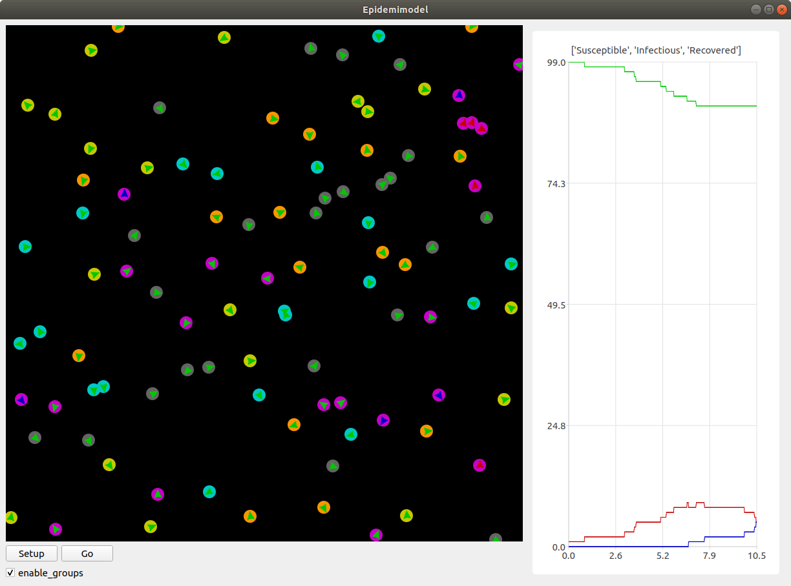
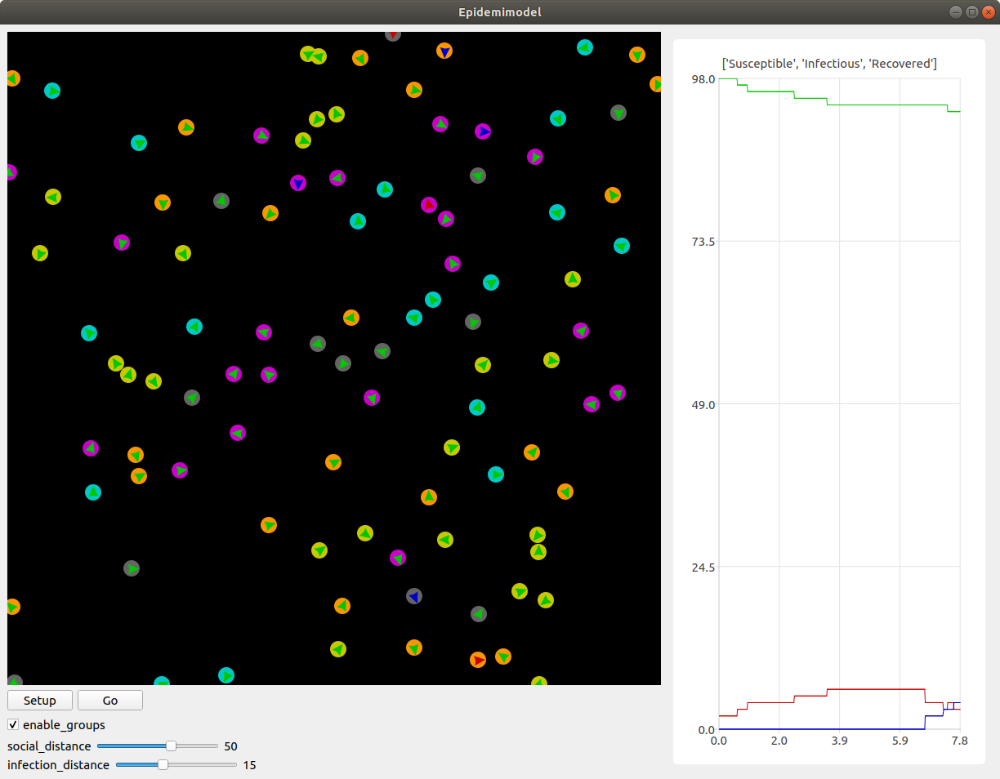

Del 3: Mindskning af smitte
===========================
Succes! Regeringen er godt tilfreds med din model, der viser
spredningen af smitte, og efterfølgende immunitet, over tid. Nu har de
givet dig en ny opgave: kom på tiltag til at begrænse smitten, og
simulér dem så i modellen, for at se, om de faktisk virker. Heldigvis
har dine kollegaer en masse idéer til, hvordan man kan mindske
smittespredning.

Hold afstand
------------
*Forslag: Agenter prøver på at undvige andre syge agenter.*

Vi vil gøre sådan, at alle agenter, der ser en syg agent indenfor en vis afstand, vender sig om og går i den modsatte retning.

Erstat denne linje i ``Person.step``::

  self.direction += randint(-10,10)

med disse::

  avg_direction = 0
  nearby_agents = 0
  for agent in self.agents_nearby(20):
      if agent.category == 1:
          avg_direction += self.direction_to(agent.x,agent.y)
          nearby_agents += 1
  if nearby_agents > 0:
      self.direction = (avg_direction / nearby_agents) + 180
  else:
      self.direction += randint(-10,10)

Det virker af meget, men ovenstående kode er faktisk ikke så indviklet.

Vi laver først to variabler, ``avg_direction`` og ``nearby_agents``, hvor den første kommer til at indeholde den gennemsnitlige retning til alle de smittede agenter, og ``nearby_agents`` indeholder antallet af smittede agenter tæt på.

Derefter undersøger vi agenter i nærheden, også dem, som er udenfor smitteradius. Hvis der er en smittet agent, lægger vi retningen til agenten til ``avg_direction``, og 1 til ``nearby_agents``.

Når alle agenterne er blevet undersøgt, skal vi ændre retning. Hvis
der ingen smittede agenter er tæt på, justerer vi bare, som normalt,
den nuværende retning med op til 10 grader. Hvis der *er* smittede
agenter, finder vi den gennemsnitlige retning med :math:`\frac{
\texttt{avg_direction} }{\texttt{nearby_agents}}`, og peger så i den
modsatte retning (ved at lægge 180 til).

Kør det resulterende program, og observer effekten. For at gøre det
mere realistisk, kan man f.eks. ændre på programmet sådan, at ikke
alle holder lige god afstand (brug ``randint``), eller at folk holder
mindre afstand over tid (brug en variabel i stil med
``infection_level``, der tæller ned).

Inddeling i grupper
-------------------
*Forslag: Agenter inddeles i grupper, og holder afstand til andre grupper.*

Det er meget effektivt at undgå de syge agenter, men i virkeligheden kan det være svært at se med det samme, om nogen er smittede, specielt da folk kan have varierende grader af symptomer. Derfor prøver vi nu en ny taktik: Folk inddeles i 5 grupper, og må kun have kontakt med dem, der er i samme gruppe.

I takt med, at vi indfører forskellige tiltag til at begrænse smitten, kunne det være smart, hvis vi kunne slå disse tiltag til og fra, uden at vi behøvede at ændre i koden hver gang. Vi starter derfor med at tilføje en *checkbox*, så man kan slå grupperne til og fra. Tilføj denne linje efter, at du har tilføjet knapperne til modellen::

  epidemic_model.add_checkbox("enable_groups")

Nu kan vi gå i gang med faktisk at lave gruppefunktionaliteten.
Tilføj, nederst i ``Person.setup``, denne linje::

  if model.enable_groups:
      self.group = randint(1,5)

Dette tildeler agenten til en tilfældig gruppe, identificeret med et ID mellem 1 og 5.

For at vi kan se forskel på de forskellige grupper, tegner vi en cirkel udenom agenterne, hvor farven på cirklen afhænger af deres gruppe. Agenter i samme gruppe har således samme farvecirkel. Tilføj disse linjer kode til ``if``-sætningen::

  self.group_indicator = model.add_ellipse(self.x-10,self.y-10,20,20,(0,0,0))
  if self.group == 1:
      self.group_indicator.color = (200,200,0)
  elif self.group == 2:
      self.group_indicator.color = (0,200,200)
  elif self.group == 3:
      self.group_indicator.color = (200,0,200)
  elif self.group == 4:
      self.group_indicator.color = (100,100,100)
  elif self.group == 5:
      self.group_indicator.color = (250,150,0)

Dette gemmer agentens farvecirkel i variablen ``group_indicator``, og giver den en farve afhængigt af ``group``-id'et.

Ændr så linje i ``Person.step``::

  if agent.category == 1:

til denne::

  if model.enable_groups and agent.group != self.group:

Det får agenten til at undgå alle, der ikke er i dens egen gruppe, fremfor dem der er smittede.
Tilføj til sidst, nederst i ``Person.step``::

  if model.enable_groups:
      self.group_indicator.x = self.x-10
      self.group_indicator.y = self.y-10

Dette får agentens "gruppe-indikator" til at følge med den rundt.

Mere/mindre afstand
-------------------
*Prøv at variere afstand, agenterne holder, og den afstand, de kan smitte på.*

For at afprøve virkningen af forskellige tiltag, gør vi nu sådan, at
agenternes fysiske afstand og smitterækkevidde kan justeres, imens
simulationen køres.

Tilføj to *sliders* til modellen med følgende kode (indsæt dem samme
sted, som du laver knapper/checkboxes)::

  epidemic_model.add_controller_row()
  epidemic_model.add_slider("social_distance", 50, 0, 80)
  epidemic_model.add_controller_row()
  epidemic_model.add_slider("infection_distance", 15, 0, 40)

Dette giver to sliders, som kan bruges til at justere variablene
``social_distance`` og ``infection_distance``. De to første tal er
minimums- og maksimumsværdierne, og det sidste tal er
startværdien.

Ændr nu denne linje i ``Person.step``::

  for agent in self.agents_nearby(20):

til denne::

  for agent in self.agents_nearby(model.social_distance):

og ændr denne::

  for agent in self.agents_nearby(12):

til denne::

  for agent in self.agents_nearby(model.infection_distance):

Prøv at køre simulationen, og juster på værdierne undervejs. Overvej,
hvilken indflydelse forholdet mellem de to værdier har på
smittetallene.
