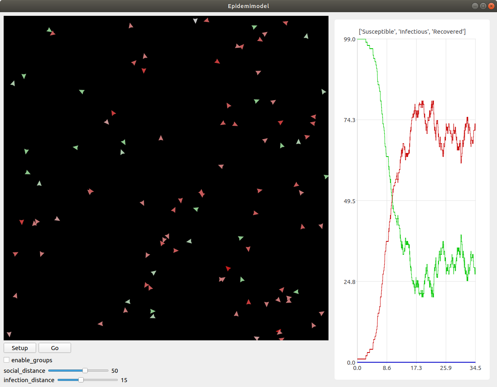

Del 4: Mutationer
=================

Gode nyheder! Din model er blevet godt modtaget af regeringen, og de
begynder snart at tage den i brug, for at vurdere, hvilke tiltag de
skal sætte i værks. Pludselig bliver du dog ringet op af en forsker
fra Statens Serum Institut, der fortæller dig, at din model er
mangelfuld! De siger, at modellen mangler detaljer om, hvordan
sygdommen kan *mutere* sig selv hen ad vejen. Forskeren giver
dig en liste over ting, der skal tilføjes, og du skynder dig at gå i
gang.

Virus-klasse
------------
Fordi, at virussens opførsel bliver mere avanceret, er det nu
nødvendigt at give den sin egen klasse, ligesom med ``Person``
klassen. Tilføj følgende klasse, oven over ``Person`` klassen::

  class Virus():
      def __init__(self, mutation):
          self.infection_level = 600
          self.mutation = mutation

      def mutate(self):
          return Virus(self.mutation)

``infection_level`` skal have samme funktionalitet som før. Vi kommer til at beskrive ``mutation`` senere.

Erstat nu denne kode i ``Person.setup``::

  if randint(1,50) == 1:
      self.infect(model)

med denne::

  self.virus = None
  if randint(1,50) == 1:
      self.infect(model, Virus(5))

I stedet for at agenten bare "simulerer" en virus ved at bruge sin
``category`` og ``infection_level``, bærer den nu rundt på
et *virus-objekt*, der holder styr på dette.

Dette betyder så også, at vi skal ændre alle de steder, der har noget
at gøre med agentens infektion, til at bruge denne klasse i
stedet. Ændr ``Person.infect`` til denne::

  def infect(self, model):
      model.Susceptible -= 1
      model.Infectious += 1
      self.color = (200,0,0)
      self.category = 1
      self.virus = virus

og ``Person.turn_immune`` til denne::

  def turn_immune(self, model):
      model.Infectious -= 1
      model.Recovered += 1
      self.color = (0,0,200)
      self.category = 2
      self.virus = None

Ændr til sidst dette stykke i ``Person.step``::

  if self.category == 1:
      for agent in self.agents_nearby(model.infection_distance):
          if agent.category == 0:
              agent.infect(model)
      self.infection_level -= 1
      if self.infection_level == 0:
          self.turn_immune(model)

til dette::

  if self.category == 1:
      for agent in self.agents_nearby(model.infection_distance):
          if agent.category == 0:
              agent.infect(model, self.virus.mutate())
      self.virus.infection_level -= 1
      if self.virus.infection_level == 0:
          self.turn_immune(model)

Her inficerer vi altså den anden agent med et nyt virus-objekt lavet
med ``Virus.mutate``, fremfor "bare" at sætte dens
``infection_level``.

Prøv at køre modellen, og se, om alt kører som det burde. Der burde
der ikke være nogen forskel fra sidst.

Mutationsstadier
----------------
Hovedideen med at lave ``Virus``-klassen er, at vi kan gemme
information om dens *mutationsstadie* i den, fremfor at gemme
den i agenten, der bærer den.

Vi vil nu ændre en smule i modellens opsætning. I stedet for, at der
kun findes én variant af sygdommen, gør vi nu sådan, at sygdommen kan
findes i *flere* varianter, og at man, hvis man har været
smittet, kun bliver immun over for den variant, man har været smittet
med.

Vi starter med at give agenten en liste over immuniteter. Tilføj denne
linje til ``Person.setup`` inden, at agenten bliver tilfældigt
inficeret::

  self.immunities = []

Denne liste skal så indeholde alle de *mutations*-ID'er for de
virusser, den har været smittet med. I den sammenhæng skal vi også
checke, at agenten ikke bliver smittet med en immun virus, når den
inficeres. I ``Person.infect``, sæt alt koden ind i følgende
``if``-sætning::

  if not virus.mutation in self.immunities:

Så køres resten af koden ikke, hvis agenten allerede har været smittet
med denne variation af virus.

Vi vil gerne have mulighed for at se med et øjekast, hvilken slags
mutation, en agent er inficeret med. Ændr derfor denne linje i
``Person.infect``::

  self.color(200,0,0)

til denne::

  self.color = (200,150-30*virus.mutation,150-30*virus.mutation)

Jo højere ``Virus.mutation`` er, jo mere rød farves agenten.

Samtidig ændrer vi nu lidt på ``Person.turn_immune``, da agenterne i stedet bliver gradvist immune, fremfor at blive komplet immune efter første gang med sygdommen.

Erstat ``Person.turn_immune`` med nedenstående::

  def turn_immune(self, model):
      model.Infectious -= 1
      model.Susceptible += 1
      self.color = (200-30*len(self.immunities),200,200-30*len(self.immunities))
      self.category = 0
      self.immunities.append(self.virus.mutation)
      self.virus = None

Der er nogle ændringer i forhold til den nuværende:

 * I stedet for at sætte agentens kategori til 2, sætter vi den
   tilbage til 0, da agenten egentlig ikke bliver immun, men går
   tilbage til at være modtagelig. Af samme årsag lægger vi 1 til
   ``model.Susceptible`` i stedet for ``model.Recovered``.

 * Agentens farve bliver nu mere grøn, jo mere resistent den er (altså
   jo flere sygdomme den har haft).

 * Vi tilføjer virussens "*mutation-ID*" til agentens liste over
   immuniteter. Den kan altså ikke smittes med denne mutation
   fremover.

Ændr i samme omgang også denne linje i ``Person.setup``::

  self.color = (0,200,0)

til denne::

  self.color = (200,200,200)

Vi gør også sådan, at hvis en virus har muteret nok gange, kan den ikke længere smitte. Opdater ``if``-sætningen i smittetrinet i ``Person.step``, sådan at der i stedet for::

  if agent.category == 0:
      agent.infect(model, self.virus.mutate())

står::

  if agent.category == 0 and self.virus.mutation > 0:
      agent.infect(model, self.virus.mutate())

Til sidst gør vi sådan, at der er en 25\% chance for, at virussen muterer, når den spredes til en anden agent. Erstat ``Virus.mutate`` med::

  def mutate(self):
      if randint(1,4) < 4:
          return Virus(self.mutation)
      else:
          return Virus(self.mutation-1)

Prøv at køre modellen nu, og observer grafen. Kan du se, hvordan de forskellige "bølger" af mutationer optræder?

Mutationseffekter
-----------------
Lige nu har de forskellige mutationer ikke nogen egentlig forskel, ud
over deres farve. Vi laver nu om på det, sådan at deres sygdomsperiode
og infektionsradius ændres, når de muterer.

Vi gør dette ved at ændre på den måde, ``Virus``-objektet
oprettes på. Erstat ``Virus.__init__`` med følgende::

  def __init__(self, mutation, duration, radius):
      self.mutation = mutation
      self.duration = duration
      self.radius = radius
      self.infection_level = self.duration

Dette gør, at vi kan specificere varigheden og rækkevidden for et
virus-objekt, når vi laver det.

Ændr på samme måde ``Virus.mutate`` til følgende::

  def mutate(self):
      if randint(1,4) < 4:
          return Virus(self.mutation,
                       self.duration,
                       self.radius)
      else:
          return Virus(self.mutation-1,
                       self.duration + randint(-100,100),
                       self.radius + randint(-5,5))

Her gør vi sådan, at virussens varighed og rækkevidde justeres en
smule, når den muterer.

Når vi opretter en ny ``Virus``, bliver vi så nødt til også at
give en oprindelig værdi for varighed og rækkevidde. Ændr denne linje
i ``Person.setup``::

  self.infect(model, Virus(5))

til denne::

  self.infect(model, Virus(5, 600, model.infection_distance))

Til sidst, ændr denne linje i ``Person.step``::

  for agent in self.agents_nearby(model.infection_distance):

til denne::

  for agent in self.agents_nearby(self.virus.distance):

Prøv at køre modellen og se, om du ser en mærkbar forskel.

.. [#] https://en.wikipedia.org/wiki/Compartmental_models_in_epidemiology#The_SIR_model
