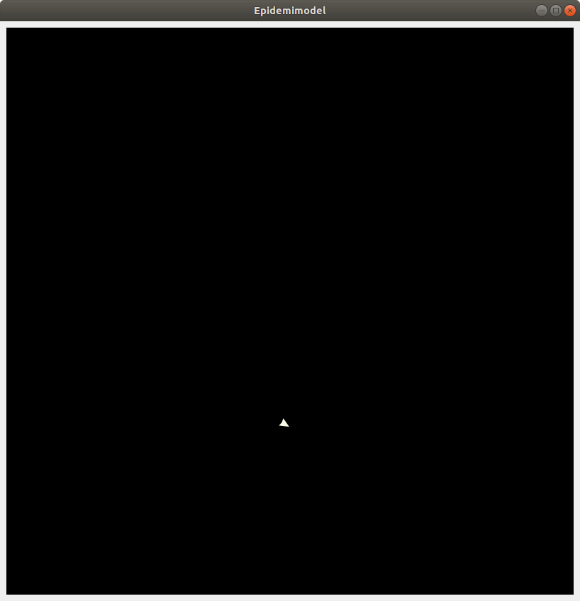
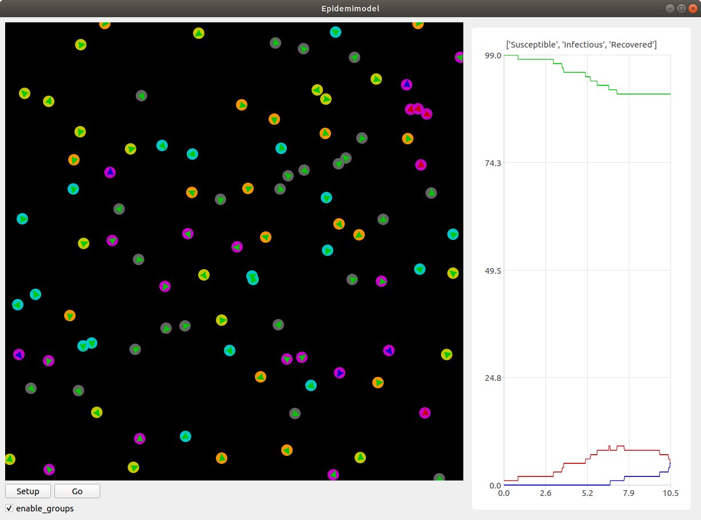

Tutorial: Epidemi-model
=======================

Tillykke! Du er, i midten af en verdensomspændende pandemi, netop
blevet ansat som den nye direktør for sundhedsstyrelsen. Regeringen
har givet dig din første opgave: forudsig, hvordan sygdommen spreder
sig, og kom med forslag, der kan mindske smittespredningen.

Du sidder længe og grubler over, hvordan du skal forudsige
spredningen, da en af dine kollegaer pludselig kommer med et godt
forslag. De foreslår, at du programmerer en *agent-baseret model*, som
kan simulere smittespredningen. På den måde kan du så bruge modellen
til at forudse, hvad der kommer til at ske i den virkelige verden. Du
tænker, at dette lyder som en fantastisk ide, og går straks i gang med
at kode en simpel model.

Den første agent
----------------

Før vi begynder at lave agenter, der kan simulere smittespredning,
skal vi først have en *model*, vi kan have dem i. Begynd med at lave
en fil, kaldet ``epidemic.py``, og giv den følgende indhold::

  from agents import *

  epidemic_model = Model("Epidemi-model", 100, 100)

  run(epidemic_model)

Linje 1 gør sådan, at alle funktionaliteterne i biblioteket
``AgentsPy`` kan bruges i filen. Det er det bibliotek, der giver
adgang til alle de nødvendige funktioner.

Linje 3 laver en model med 100x100 `tiles` (felter), og navnet
`Epidemi-model`.

Linje 5 starter modellen.

Prøv at køre programmet, og se, hvad der sker. Der burde vises et
vindue af en sort firkant. Dette er en tom model.

Tilføj nu, på linje 4, følgende kode::

  epidemic_model.add_agent(Agent())

Denne linje laver en agent ved at bruge ``Agent()``, og tilføjer
den så til modellen ved at bruge ``add_agent()``. Starter man
modellen igen, burde der vises en enkelt lille trekant inde i
modellen - dette er agenten.

Knapper
-------
For at gøre det nemmere at styre vores model undervejs, vil vi gerne
tilføje nogle knapper til vinduet, som man kan klikke på for blandt
andet at starte og stoppe simulationen. Lad os først tilføje en
`setup` knap, som genstarter modellen. Indtil videre skal den bare
slette alle eksisterende agenter, og lave en ny.

Slet først den linje, du lige har tilføjet ovenfor (altså den, der
laver en agent og tilføjer den til modellen). Tilføj så denne
funktion, lige efter, at du har importeret ``agents``::

  def model_setup(model):
      model.reset()
      model.add_agent(Agent())

Funktionen her sletter alle agenter med ``model.reset()`` og tilføjer
en ny med ``model.add_agent()``. Det kan virke lidt ligegyldigt nu,
men det vil blive brugbart senere.

Tilføj så, efter du har lavet ``epidemic_model``, følgende linje::

  epidemic_model.add_button("Setup", model_setup)

Linjen tilføjer en knap til vinduet som, når den klikkes på, kører
``model_setup``-funktionen.

.. image:: images/epidemic/epidemic-1.2.png
   :height: 400

Flere agenter
-------------
Lad os tilføje lidt flere agenter. Ændr ``model_setup`` funktionen, sådan at
den siger følgende::

  def model_setup(model):
      model.reset()
      for agent in range(100):
          model.add_agent(Agent())

Nu laver vi 100 agenter og tilføjer dem til modellen.

Lige nu laver agenterne ikke særlig meget. Lad os gøre det muligt for
agenterne at gå rundt omkring. Tilføj denne ``model_step`` funktion under
``model_setup`` funktionen::

  def model_step(model):
      for agent in model.agents:
          agent.direction += randint(-10,10)
          agent.forward()

Vi gennemgår funktionen:

- For hver agent i modellen:

  * Juster dens retning med en tilfældig vinkel mellem -10 og 10.
  * Ryk den et skridt fremad i den retning, den peger.

``randint(a,b)`` er en funktion, det vælger et tilfældigt tal mellem
``a`` og ``b``. For at bruge den, skal du lige importere den (gør
dette i toppen af filen, sammen med at du importerer ``agents``)::

  from random import randint

Slut af med at tilføje denne linje efter at du tilføjer `setup`-knappen::

  epidemic_model.add_toggle_button("Go", model_step)

Dette laver en knap, som man kan slå til og fra. Når den er slået til,
kører den ``model_step``-funktionen konstant, hvilket får agenterne til
at bevæge sig rundt.

.. image:: images/epidemic/epidemic-1.3.png
   :height: 400

SIR-modellen
------------

Du har nu din model, og dine agenter - men hvordan skal du simulere
sygdommen? Du grubler meget længe, indtil at en anden kollega
fortæller dig om
`SIR-modellen <https://en.wikipedia.org/wiki/Compartmental_models_in_epidemiology#The_SIR_model>`_ [#]_ :
en matematisk model, som bruges til at modellere sygdomsspredning.

.. role:: susceptible
.. role:: infectious
.. role:: recovered

.. raw:: html

    

Modellen har tre kategorier, som den opdeler folk i:

 * :susceptible:`Susceptible`: Folk i denne gruppe er modtagelige, og kan blive smittet, hvis de kommer i kontakt med en, der bærer sygdommen.
 * :infectious:`Infectious`: Folk i denne gruppe er blevet syge, og kan smitte folk, der er modtagelige.
 * :recovered:`Recovered`: Folk i denne gruppe har haft sygdommen og er blevet raske og immune, og kan derfor ikke længere hverken smitte eller blive smittet.

En person kan altså kun være i én kategori ad gangen, og deres tilstand vil have mønsteret:

 :susceptible:`Susceptible` → :infectious:`Infectious` → :recovered:`Recovered`

Du tænker, at dette er lige den model, du har brug for, og går straks i gang med at kode.

Fra agent til person
--------------------

Lige nu er vores agenter "bare" agenter. Vi vil gerne gøre dem lidt
mere avancerede, sådan at de blandt andet kan selv kan holde styr på,
hvilken kategori af SIR-modellen, de er i.

Tilføj, over din ``model_setup``-funktion (men under dine imports), følgende kode::

  class Person(Agent):
      def setup(self,model):
          self.category = 0

      def step(self,model):
          self.direction += randint(-10,10)
          self.forward()

Ovenstående kode definerer en *klasse*, som har noget opførsel
beskrevet i sine egne funktioner ``Person.setup`` og ``Person.step``.

Ændr så ``model_setup``-funktionen til::

  def model_setup(model):
      model.reset()
      for person in range(100):
          model.add_agent(Person())

Nu tilføjer vi altså personer i stedet for "bare" normale agenter.

Bemærk, at indholdet i ``Person.step`` lidt ligner det, der står i
``model_step``-funktionen i forvejen. Faktisk kan vi nu også ændre i
``model_step``-funktionen, sådan at der i stedet står::

  def model_step(model):
      for person in model.agents:
          person.step(model)

Prøv nu at køre modellen igen. Hvis du har gjort det rigtigt, burde den ikke se anderledes ud end før.

Kategorier
----------
For ikke at skulle skrive navnene på kategorierne hele tiden, bruger vi i stedet tal, sådan at

============    =====
  Kategori        #
============    =====
Susceptible       0
Infectious        1
Recovered         2
============    =====

Tilføj nu en ``infect``-funktion til ``Person``, som har følgende udseende::

  def infect(self, model):
      self.color = (200, 0, 0)
      self.category = 1

Funktionen giver agenten en rød farve, og sætter den i kategori 1.

Omskriv så ``Person.setup`` til følgende::

  def setup(self,model):
      self.category = 0
      self.color = (0, 200, 0)
      if randint(1,50) == 1:
          self.infect(model)

Vi gør her sådan, at de fleste agenter starter med at være raske og
have en grøn farve, men en lille del (omkring 2%) starter med at være
syge og have en rød farve.

.. image:: images/epidemic/epidemic-2.2.png
   :height: 400

Smittespredning
---------------

Ideen med modellen er, at de syge agenter skal smitte de raske
agenter. Vi gør det på den måde, at en syg agent smitter alle raske
agenter, som er indenfor en bestemt afstand af den. Tilføj følgende
kode i bunden af ``Person.step``-funktionen::

  if self.category == 1:
      for agent in self.agents_nearby(12):
          if agent.category == 0:
              agent.infect(model)

Koden siger, at hvis agenten er i kategori 1 (altså syg), så smitter
den alle agenter indenfor en radius af 12 (agentens egen radius er på
4).

.. image:: images/epidemic/epidemic-2.3.png
   :height: 400

Immunitet
---------

Lige nu kan vores model vise 2 af de 3 kategorier, altså "susceptible"
og "infectious". Som det sidste led i modellen, skal agenter i
"infectious" kategorien flyttes til "recovered" kategorien, når der er
gået et stykke tid.

Tilføj først først denne funktion ``turn_immune`` til
``Person``::

  def turn_immune(self, model):
      self.color = (0,0,200)
      self.category = 2

Denne minder om ``Person.infect``, men i stedet for at personen
bliver rød og inficeret, bliver den blå og opnår immunitet.

Tilføj så denne linje til ``Person.infect``::

  self.infection_level = 600

Idéen med ``infection_level``-variablen er, at den langsomt tæller
ned, og, når den rammer 0, bliver den inficerede agent immun. Det gør
vi ved at tilføje disse tre linjer i bunden af ``if``-sætningen i
``Person.step``::

  self.infection_level -= 1
  if self.infection_level == 0:
      self.turn_immune(model)

``if``-sætningen burde til slut gerne se således ud::

  if self.category == 1:
      for agent in self.agents_nearby(12):
          if agent.category == 0:
              agent.infect(model)
      self.infection_level -= 1
      if self.infection_level == 0:
          self.turn_immune(model)

Når du kører programmet, burde du nu have en færdig implementation af SIR-modellen.

Grafer
------
Til slut vil vi gerne se, om vores model forløber på samme måde som
SIR-modellen. Det gør vi ved at indsætte en graf, som viser
fordelingen af agenter over tid.

Ideen med grafen kommer til at være, at vi optæller antallet af
agenter i hver kategori, og så får grafen til at vise tre linjer, som
viser antallene i hver kategori som funktion af tid.

Begynd først med at indsætte disse tre linjer i
``model_setup``-funktionen, lige efter du har kaldt
``model.reset()``::

  model.Susceptible = 0
  model.Infectious = 0
  model.Recovered = 0

Vi får agenterne selv til at tildele sig de forskellige kategorier, så vi lader alle tre starte med at være 0.

Tilføj øverst i ``Person.setup``::

  model.Susceptible += 1

Tilføj øverst i ``Person.infect``::

  model.Susceptible -= 1
  model.Infectious += 1

Tilføj øverst i ``Person.turn_immune``::

  model.Infectious -= 1
  model.Recovered += 1

Nu har vi styr på dataen til vores model. Programmet skal dog lige
vide, at det skal opdatere grafen, imens *Go*-knappen holdes
inde. Tilføj denne linje nederst i ``model_step``-funktionen::

  model.update_plots()

Det eneste, vi mangler nu, er at tilføje selve grafen. Indsæt denne
linje, lige efter der hvor du tilføjer knapperne til modellen::

  epidemic_model.multi_line_chart(["Susceptible","Infectious","Recovered"],[(0, 200, 0),(200, 0, 0),(0, 0, 200)])

Prøv at køre modellen, indtil der ikke er flere inficerede agenter tilbage, og sammenlign så den graf du får med den, der er på `Wikipedia-siden for SIR-modellen <https://en.wikipedia.org/wiki/Compartmental_models_in_epidemiology#The_SIR_model}{>`_.

Mindskning af smitte
--------------------

Succes! Regeringen er godt tilfreds med din model, der viser
spredningen af smitte, og efterfølgende immunitet, over tid. Nu har de
givet dig en ny opgave: kom på tiltag til at begrænse smitten, og
simulér dem så i modellen, for at se, om de faktisk virker. Heldigvis
har dine kollegaer en masse idéer til, hvordan man kan mindske
smittespredning.

Hold afstand
------------
*Forslag: Agenter prøver på at undvige andre syge agenter.*

Vi vil gøre sådan, at alle agenter, der ser en syg agent indenfor en vis afstand, vender sig om og går i den modsatte retning.

Erstat denne linje i ``Person.step``::

  self.direction += randint(-10,10)

med disse::

  avg_direction = 0
  nearby_agents = 0
  for agent in self.agents_nearby(20):
      if agent.category == 1:
          avg_direction += self.direction_to(agent.x,agent.y)
          nearby_agents += 1
  if nearby_agents > 0:
      self.direction = (avg_direction / nearby_agents) + 180
  else:
      self.direction += randint(-10,10)

Det virker af meget, men ovenstående kode er faktisk ikke så indviklet.

Vi laver først to variabler, ``avg_direction`` og ``nearby_agents``, hvor den første kommer til at indeholde den gennemsnitlige retning til alle de smittede agenter, og ``nearby_agents`` indeholder antallet af smittede agenter tæt på.

Derefter undersøger vi agenter i nærheden, også dem, som er udenfor smitteradius. Hvis der er en smittet agent, lægger vi retningen til agenten til ``avg_direction``, og 1 til ``nearby_agents``.

Når alle agenterne er blevet undersøgt, skal vi ændre retning. Hvis
der ingen smittede agenter er tæt på, justerer vi bare, som normalt,
den nuværende retning med op til 10 grader. Hvis der *er* smittede
agenter, finder vi den gennemsnitlige retning med :math:`\frac{
\texttt{avg_direction} }{\texttt{nearby_agents}}`, og peger så i den
modsatte retning (ved at lægge 180 til).

Kør det resulterende program, og observer effekten. For at gøre det
mere realistisk, kan man f.eks. ændre på programmet sådan, at ikke
alle holder lige god afstand (brug ``randint``), eller at folk holder
mindre afstand over tid (brug en variabel i stil med
``infection_level``, der tæller ned).

Inddeling i grupper
-------------------
*Forslag: Agenter inddeles i grupper, og holder afstand til andre grupper.*

Det er meget effektivt at undgå de syge agenter, men i virkeligheden kan det være svært at se med det samme, om nogen er smittede, specielt da folk kan have varierende grader af symptomer. Derfor prøver vi nu en ny taktik: Folk inddeles i 5 grupper, og må kun have kontakt med dem, der er i samme gruppe.

I takt med, at vi indfører forskellige tiltag til at begrænse smitten, kunne det være smart, hvis vi kunne slå disse tiltag til og fra, uden at vi behøvede at ændre i koden hver gang. Vi starter derfor med at tilføje en *checkbox*, så man kan slå grupperne til og fra. Tilføj denne linje efter, at du har tilføjet knapperne til modellen::

  epidemic_model.add_checkbox("enable_groups")

Nu kan vi gå i gang med faktisk at lave gruppefunktionaliteten.
Tilføj, nederst i ``Person.setup``, denne linje::

  if model.enable_groups:
      self.group = randint(1,5)

Dette tildeler agenten til en tilfældig gruppe, identificeret med et ID mellem 1 og 5.

For at vi kan se forskel på de forskellige grupper, tegner vi en cirkel udenom agenterne, hvor farven på cirklen afhænger af deres gruppe. Agenter i samme gruppe har således samme farvecirkel. Tilføj disse linjer kode til ``if``-sætningen::

  self.group_indicator = model.add_ellipse(self.x-10,self.y-10,20,20,(0,0,0))
  if self.group == 1:
      self.group_indicator.color = (200,200,0)
  elif self.group == 2:
      self.group_indicator.color = (0,200,200)
  elif self.group == 3:
      self.group_indicator.color = (200,0,200)
  elif self.group == 4:
      self.group_indicator.color = (100,100,100)
  elif self.group == 5:
      self.group_indicator.color = (250,150,0)

Dette gemmer agentens farvecirkel i variablen ``group_indicator``, og giver den en farve afhængigt af ``group``-id'et.

Ændr så linje i ``Person.step``::

  if agent.category == 1:

til denne::

  if model.enable_groups and agent.group != self.group:

Det får agenten til at undgå alle, der ikke er i dens egen gruppe, fremfor dem der er smittede.
Tilføj til sidst, nederst i ``Person.step``::

  if model.enable_groups:
      self.group_indicator.x = self.x-10
      self.group_indicator.y = self.y-10

Dette får agentens "gruppe-indikator" til at følge med den rundt.

Mere/mindre afstand
-------------------
*Prøv at variere afstand, agenterne holder, og den afstand, de kan smitte på.*

For at afprøve virkningen af forskellige tiltag, gør vi nu sådan, at
agenternes fysiske afstand og smitterækkevidde kan justeres, imens
simulationen køres.

Tilføj to *sliders* til modellen med følgende kode (indsæt dem samme
sted, som du laver knapper/checkboxes)::

  epidemic_model.add_controller_row()
  epidemic_model.add_slider("social_distance", 50, 0, 80)
  epidemic_model.add_controller_row()
  epidemic_model.add_slider("infection_distance", 15, 0, 40)

Dette giver to sliders, som kan bruges til at justere variablene
``social_distance`` og ``infection_distance``. De to første tal er
minimums- og maksimumsværdierne, og det sidste tal er
startværdien.

Ændr nu denne linje i ``Person.step``::

  for agent in self.agents_nearby(50):

til denne::

  for agent in self.agents_nearby(model.social_distance):

og ændr denne::

  for agent in self.agents_nearby(12):

til denne::

  for agent in self.agents_nearby(model.infection_distance):

.. image:: images/epidemic/epidemic-3.3.png
   :height: 400

Prøv at køre simulationen, og juster på værdierne undervejs. Overvej,
hvilken indflydelse forholdet mellem de to værdier har på
smittetallene.

Mutationer
----------

Gode nyheder! Din model er blevet godt modtaget af regeringen, og de
begynder snart at tage den i brug, for at vurdere, hvilke tiltag de
skal sætte i værks. Pludselig bliver du dog ringet op af en forsker
fra Statens Serum Institut, der fortæller dig, at din model er
mangelfuld! De siger, at modellen mangler detaljer om, hvordan
sygdommen kan *mutere* sig selv hen ad vejen. Forskeren giver
dig en liste over ting, der skal tilføjes, og du skynder dig at gå i
gang.

Virus-klasse
------------
Fordi, at virussens opførsel bliver mere avanceret, er det nu
nødvendigt at give den sin egen klasse, ligesom med ``Person``
klassen. Tilføj følgende klasse, oven over ``Person`` klassen::

  class Virus():
      def __init__(self, mutation):
          self.infection_level = 600
          self.mutation = mutation

      def mutate(self):
          return Virus(self.mutation)

``infection_level`` skal have samme funktionalitet som før. Vi kommer til at beskrive ``mutation`` senere.

Erstat nu denne kode i ``Person.setup``::

  if randint(1,50) == 1:
      self.infect(model)

med denne::

  self.virus = None
  if randint(1,50) == 1:
      self.infect(model, Virus(5))

I stedet for at agenten bare "simulerer" en virus ved at bruge sin
``category`` og ``infection_level``, bærer den nu rundt på
et *virus-objekt*, der holder styr på dette.

Dette betyder så også, at vi skal ændre alle de steder, der har noget
at gøre med agentens infektion, til at bruge denne klasse i
stedet. Ændr ``Person.infect`` til denne::

  def infect(self, model):
      model.Susceptible -= 1
      model.Infectious += 1
      self.color = (200,0,0)
      self.category = 1
      self.virus = virus

og ``Person.turn_immune`` til denne::

  def turn_immune(self, model):
      model.Infectious -= 1
      model.Recovered += 1
      self.color = (0,0,200)
      self.category = 2
      self.virus = None

Ændr til sidst dette stykke i ``Person.step``::

  if self.category == 1:
      for agent in self.agents_nearby(model.infection_distance):
          if agent.category == 0:
              agent.infect(model)
      self.infection_level -= 1
      if self.infection_level == 0:
          self.turn_immune(model)

til dette::

  if self.category == 1:
      for agent in self.agents_nearby(model.infection_distance):
          if agent.category == 0:
              agent.infect(model, self.virus.mutate())
      self.virus.infection_level -= 1
      if self.virus.infection_level == 0:
          self.turn_immune(model)

Her inficerer vi altså den anden agent med et nyt virus-objekt lavet
med ``Virus.mutate``, fremfor "bare" at sætte dens
``infection_level``.

Prøv at køre modellen, og se, om alt kører som det burde. Der burde
der ikke være nogen forskel fra sidst.

Mutationsstadier
----------------
Hovedideen med at lave ``Virus``-klassen er, at vi kan gemme
information om dens *mutationsstadie* i den, fremfor at gemme
den i agenten, der bærer den.

Vi vil nu ændre en smule i modellens opsætning. I stedet for, at der
kun findes én variant af sygdommen, gør vi nu sådan, at sygdommen kan
findes i *flere* varianter, og at man, hvis man har været
smittet, kun bliver immun over for den variant, man har været smittet
med.

Vi starter med at give agenten en liste over immuniteter. Tilføj denne
linje til ``Person.setup`` inden, at agenten bliver tilfældigt
inficeret::

  self.immunities = []

Denne liste skal så indeholde alle de *mutations*-ID'er for de
virusser, den har været smittet med. I den sammenhæng skal vi også
checke, at agenten ikke bliver smittet med en immun virus, når den
inficeres. I ``Person.infect``, sæt alt koden ind i følgende
``if``-sætning::

  if not virus.mutation in self.immunities:

Så køres resten af koden ikke, hvis agenten allerede har været smittet
med denne variation af virus.

Vi vil gerne have mulighed for at se med et øjekast, hvilken slags
mutation, en agent er inficeret med. Ændr derfor denne linje i
``Person.infect``::

  self.color(200,0,0)

til denne::

  self.color = (200,150-30*virus.mutation,150-30*virus.mutation)

Jo højere ``Virus.mutation`` er, jo mere rød farves agenten.

Samtidig ændrer vi nu lidt på ``Person.turn_immune``, da agenterne i stedet bliver gradvist immune, fremfor at blive komplet immune efter første gang med sygdommen.

Erstat ``Person.turn_immune`` med nedenstående::

  def turn_immune(self, model):
      model.Infectious -= 1
      model.Susceptible += 1
      self.color = (200-30*len(self.immunities),200,200-30*len(self.immunities))
      self.category = 0
      self.immunities.append(self.virus.mutation)
      self.virus = None

Der er nogle ændringer i forhold til den nuværende:

 * I stedet for at sætte agentens kategori til 2, sætter vi den
   tilbage til 0, da agenten egentlig ikke bliver immun, men går
   tilbage til at være modtagelig. Af samme årsag lægger vi 1 til
   ``model.Susceptible`` i stedet for ``model.Recovered``.

 * Agentens farve bliver nu mere grøn, jo mere resistent den er (altså
   jo flere sygdomme den har haft).

 * Vi tilføjer virussens "*mutation-ID*" til agentens liste over
   immuniteter. Den kan altså ikke smittes med denne mutation
   fremover.

Ændr i samme omgang også denne linje i ``Person.setup``::

  self.color = (0,200,0)

til denne::

  self.color = (200,200,200)

Vi gør også sådan, at hvis en virus har muteret nok gange, kan den ikke længere smitte. Opdater ``if``-sætningen i smittetrinet i ``Person.step``, sådan at der i stedet for::

  if agent.category == 0:
      agent.infect(model, self.virus.mutate())

står::

  if agent.category == 0 and self.virus.mutation > 0:
      agent.infect(model, self.virus.mutate())

Til sidst gør vi sådan, at der er en 25\% chance for, at virussen muterer, når den spredes til en anden agent. Erstat ``Virus.mutate`` med::

  def mutate(self):
      if randint(1,4) < 4:
          return Virus(self.mutation)
      else:
          return Virus(self.mutation-1)

Prøv at køre modellen nu, og observer grafen. Kan du se, hvordan de forskellige "bølger" af mutationer optræder?

.. image:: images/epidemic/epidemic-4.2.png
   :height: 400

Mutationseffekter
-----------------
Lige nu har de forskellige mutationer ikke nogen egentlig forskel, ud
over deres farve. Vi laver nu om på det, sådan at deres sygdomsperiode
og infektionsradius ændres, når de muterer.

Vi gør dette ved at ændre på den måde, ``Virus``-objektet
oprettes på. Erstat ``Virus.__init__`` med følgende::

  def __init__(self, mutation, duration, radius):
      self.mutation = mutation
      self.duration = duration
      self.radius = radius
      self.infection_level = self.duration

Dette gør, at vi kan specificere varigheden og rækkevidden for et
virus-objekt, når vi laver det.

Ændr på samme måde ``Virus.mutate`` til følgende::

  def mutate(self):
      if randint(1,4) < 4:
          return Virus(self.mutation,
                       self.duration,
                       self.radius)
      else:
          return Virus(self.mutation-1,
                       self.duration + randint(-100,100),
                       self.radius + randint(-5,5))

Her gør vi sådan, at virussens varighed og rækkevidde justeres en
smule, når den muterer.

Når vi opretter en ny ``Virus``, bliver vi så nødt til også at
give en oprindelig værdi for varighed og rækkevidde. Ændr denne linje
i ``Person.setup``::

  self.infect(model, Virus(5))

til denne::

  self.infect(model, Virus(5, 600, model.infection_distance))

Til sidst, ændr denne linje i ``Person.step``::

  for agent in self.agents_nearby(model.infection_distance):

til denne::

  for agent in self.agents_nearby(self.virus.distance):

Prøv at køre modellen og se, om du ser en mærkbar forskel.

.. [#] https://en.wikipedia.org/wiki/Compartmental_models_in_epidemiology#The_SIR_model
