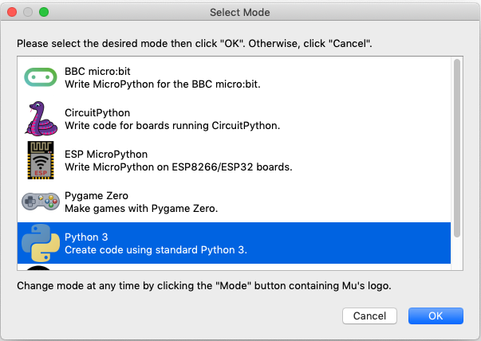
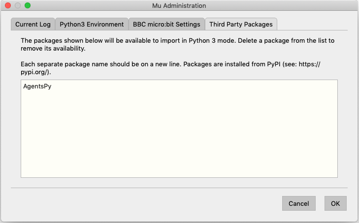
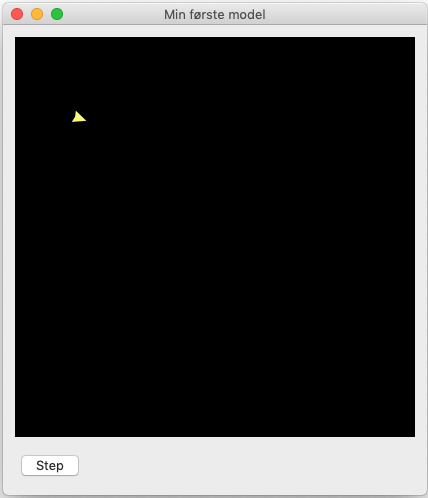
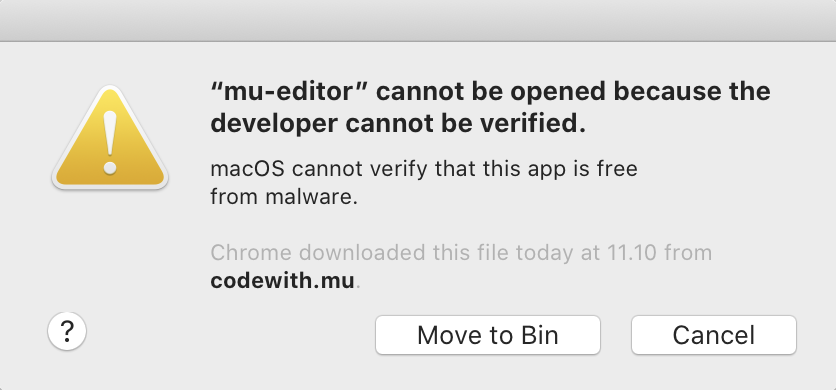
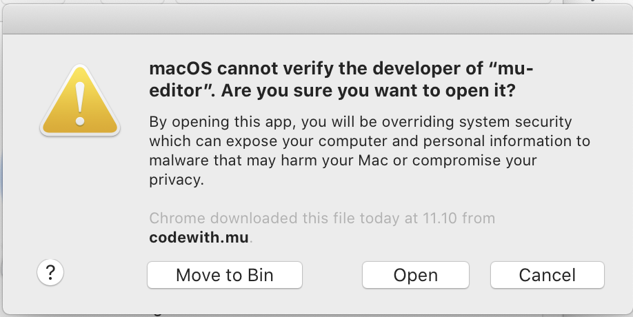

Kom godt i gang (Mu-editor)
===========================

Installation af Mu-editoren
---------------------------
Hent og installér denne beta-udgave af Mu-editoren:

- `Hent Mu-editor til Windows (64 bit) <https://github.com/mu-editor/mu/releases/download/1.1.0-beta.2/Mu-Editor-Win64-1.1.0b2.msi>`_
- `Hent Mu-editor til Mac OS X <https://github.com/mu-editor/mu/releases/download/1.1.0-beta.2/Mu.Editor.1.1.0b2.dmg>`_
- `Hent Mu-editor til Linux <https://github.com/mu-editor/mu/archive/1.1.0-beta.2.tar.gz>`_

.. warning:: Nyeste udgave af Mu fra deres hjemmeside er 1 år gammel
             og understøtter ikke nyeste udgaver af Mac OS X og heller
             ikke installation af eksterne biblioteker, såsom AgentsPy.

Start Mu
--------
Åbn Mu-editoren. Første gang Mu åbner bliver du bedt om at vælge en
*mode* i dialogen **Select Mode**. Her skal du vælge |PYTHON| **Python
3** og trykke "OK":

Har du problemer med at åbne Mu på Mac? Læs :ref:`fejlsøgningsguiden i
bunden af denne side <mu-on-mac-issues>`.
            
Installer AgentsPy
------------------
1. Klik på |SETTINGS|-ikonet nederst i højre hjørne.
2. Vælg fanen *Third Party Packages*.
3. I tekstfeltet, indtast `agentspy` og klik "OK".

   
Dit første program med AgentsPy
-------------------------------

Du er nu klar til at skrive dit første lille agent-baserede
program. Du placerer cursoren på linjen efter den hvor der
står ``# Write your code here :-)``,og skriver følgende::

  # Importer biblioteket `agents`
  from agents import *

  # Opret en model og en agent
  min_model = Model("Min første model", 50, 50)
  min_agent = Agent()

  # Tilføj agenten til modellen
  min_model.add_agent(min_agent)

  # Tilføj en `step`-funktion, og en knap der aktiverer den
  def step(model):
    min_agent.forward(10)

  min_model.add_button("Step", step)

  # Kør modellen
  run(min_model)

Når du har skrevet ovenstående, kan du prøve programmet ved at trykke
på Run |RUN|.

Du bliver nu bedt om at gemme filen. Gem filen som ``agentdemo.py``
(**OBS!** Du må IKKE gemme den som ``agents.py``)

Du burde nu se følgende vindue:

Prøv at trykke på knappen "Step" et par gange, for at få din agent til
at tage et skridt.

Linjerne der starter med ``#`` i programmet, bliver forstået som en
kommentar til koden, og får ikke betydning for dit program.

Næste skridt
------------
Tillykke du er nu godt igang! Som det næste vil vi anbefale at du
følger en af vores tutorials her på siden.

Hvis du vil vide mere om selve Mu-editoren, så har holdet bag
Mu-editoren en række tutorials, der kan gøre dig fortrolig med hvordan
Mu fungere, de er på engelsk og du finder dem her:
https://codewith.mu/en/tutorials/

.. _mu-on-mac-issues:

Problemer med at åbne Mu på Mac?
--------------------------------

Hvis du er Mac-bruger og ser en besked om, at programmet ikke kan
åbnes, fordi det stammer fra en ukendt udvikler eller ikke blev hentet
fra App Store, skal du gøre følgende:

* Finde programmet i *Finder*. 
* Holde *control* nede og klikke - eller højreklikke, hvis du har mus tilsluttet. 
* Der dukker nu en menu frem og øverst kan du vælge *open*. 
* Der vil nu dukke et vindue op, hvor du igen vælger *open*
* Fremover vil programmet åbne, som alle andre programmer. 

Hvis det stadig ikke virker, så prøv først at genstarte computere, og
hvis det så stadig ikke virker, kan du prøve følgende, der slår nogle
sikkerhedstjeks fra:

* Åben en Terminal
* Indtast kommandoen ``sudo spctl --master-disable``
* Indtast dit password og tryk enter
* For at returnere til de oprindelige indstillinger, kan du køre
  kommandoen ``sudo spctl --master-enable`` i en terminal.
