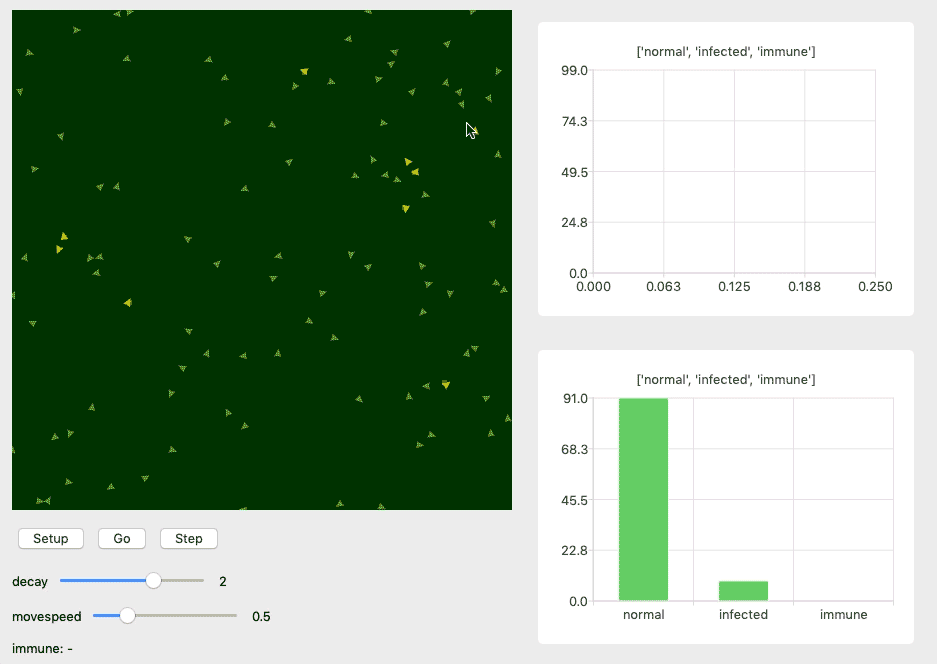

AgentsPy: Agent-based simulation in Python
==========================================
AgentsPy is a library for Python for doing Agent-based simulation in
education. It allows students to understand phenomenons from
e.g. biology, economics, physics, chemistry, through programming small
simulations.

AgentsPy is influenced by *NetLogo*, the Python *turtle* library, and
is currently still under development at DIKU, University of Copenhagen.

As an example, here's an epidemic simulation, that show-cases some of
the features of AgentsPy:

Guides
------

 * Getting started with AgentsPy and the Mu-editor
 * Tutorial - Simple epidemic model
 * Tutorial - Current in a wire
 * Tutorial - Predator-prey model

.. toctree::
   :maxdepth: 1

   tutorial

API documentation
-----------------

.. toctree::
   :maxdepth: 1

   agent
   tile
   model
   simplemodel

Can't find what you are looking for?
------------------------------------
* :ref:`Search <search>` the entire documentation

* :ref:`genindex` of all methods and classes

.. * :ref:`modindex`

License
-------
AgentsPy is implemented using PyQt5, and thus we have to release
AgentsPy under the same GPL license.

.. toctree::
   :maxdepth: 1

   license
