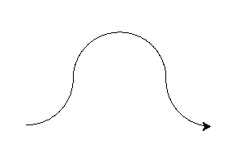

Introduktion til Python
=======================

*Hvis du ikke endnu har installeret en editor, så brug en af følgende guides:*

 * :doc:`godtigang_mu`
 * :doc:`godtigang_thonny`

Turtle-biblioteket
------------------
Som indledning til at bruge det agent-baserede bibliotek ``AgentsPy`` vil vi bruge et andet bibliotek, kaldet ``turtle``. Et bibliotek er en samling af eksterne funktioner, som man kan bruge i sit eget program.

Start med at åbne din editor, lav en ny fil, og gem den som ``turtle_test.py``.

Lad os nu prøve at kode med ``turtle`` biblioteket. For at bruge et bibliotek, skal man først *importere* det. Tilføj følgende linje kode til din fil::

  from turtle import *

Stjernen ``*`` indikerer, at vi gerne vil importere alle funktioner fra biblioteket.
Ovenstående linje kode gør ikke noget af sig selv, men efter importeringen kan du nu fremover i din fil bruge funktioner fra ``turtle`` biblioteket.

Lad os nu lave en "turtle". En turtle er en lille agent (markeret med en pil), som kan flyttes rundt på en skærm ved at kalde nogle bestemte funktioner. Lav en turtle ved nederst i filen at skrive::

  t = Turtle()

Når du kører din fil, burde der komme et vindue frem med en hvid baggrund og en sort pil i midten. Den sorte pil er dit "turtle-objekt", som kan refereres med variablen ``t``.

Luk vinduet, og tilføj denn linje kode til filen::

  t.forward(100)

Kører du filen, burde gerne se din turtle rykke sig lidt fremad. Giv den lidt flere instrukser:
::

  t.left(90)
  t.color("red")
  t.forward(200)

Det her er bare nogle af de funktioner, man kan bruge på sin "turtle" (agenterne fra ``AgentsPy`` har nogle lignende funktioner).

Opgave 1
--------
Brug `t.forward` og `t.left` til at få turtle-objektet til at tegne en firkant.

Egne funktioner
---------------
Indtil videre har vi kun brugt eksisterende funktioner fra biblioteket, men det er også muligt at lave sine egne funktioner. Funktioner definerer en sekvens af kode, som man kan køre gentagne gange ved at "kalde" funktionen.

Vi laver nu vores egen funktion, kaldet ``draw_square``, som tegner en firkant. Slet din eksisterende kode, *undtagen* den øverste linje, hvor du importerer ``turtle`` biblioteket. Begynd så med at tilføje denne linje, der erklærer funktionen::

  def draw_square(turtle):

I denne funktion er ``turtle`` et *argument*, som man kan give med til funktionen, når man kalder den. For at sammenligne: ved funktionskaldet ``t.color("red")`` er det ``"red"``, som er argumentet. I dette tilfælde er argumentet den turtle, som vi bruger til at tegne firkanten.

Tilføj nu de følgende linjer kode lige under funktionserklæringen::

  turtle.left(90)
  turtle.forward(100)
  turtle.left(90)
  turtle.forward(100)
  turtle.left(90)
  turtle.forward(100)
  turtle.left(90)
  turtle.forward(100)

Koden får turtle-objektet til at dreje sig 90 grader og gå 100 skridt frem, fire gange.

Det er vigtigt, at kode, som er en del af funktionen, rykkes ud, sådan at det står længere til højre end selve funktionserklæringen. Hele funktionen skal altså se således ud::

  def draw_square(turtle):
      turtle.left(90)
      turtle.forward(100)
      turtle.left(90)
      turtle.forward(100)
      turtle.left(90)
      turtle.forward(100)
      turtle.left(90)
      turtle.forward(100)

Prøv nu at lave et turtle-objekt, gemt i variablen ``t``, og *kald* så funktionen ved at skrive::

  draw_square(t)

Bemærk, at en funktion kan kun kaldes, efter at den er blevet erklæret, så ovenstående linje kode skal stå *under* funktionen selv.

Loops
-----
Ved et nærmere kig på ``draw_square`` funktionen er den ikke særlig "smart" skrevet. Koden, der tegner en linje, er ens for hver af de fire linjer. Vi kan gøre det smartere ved at lave et *loop*, der i stedet kører koden for hver linje 4 gange.

Slet indholdet af ``draw_square``, og skriv i stedet følgende linje (husk at rykke linjen ud til højre, så den stadig er "inde" i ``draw_square``)::

  for i in range(4):

Dette "for-loop" gentages 4 gange. Ligesom at vi kan have kode inde i funktioner, kan vi også have kode inde i loops. Lav efter ovenstående linje et nyt udryk, og skriv::

  turtle.left(90)
  turtle.forward(100)

Nu burde hele funktionen se sådan ud::

  def draw_square(t):
      for i in range(4):
          turtle.left(90)
          turtle.forward(100)

Kører du koden igen, burde du gerne få samme resultat.

Opgave 2
--------
Prøv at lave en funktion, ``draw_circle``, der ligesom ``draw_square`` tager et turtle-objekt, men i stedet tegner en cirkel.

*Hint: Du behøver kun at ændre på nogle af tallene i* ``draw_square``.

If-sætninger
------------
Det er også muligt at have kode, som kun bliver kørt, hvis nogle bestemte kriterier er opfyldt. Lad os, for at demonstrere, prøve at lave en funktion, der tegner et "S". Start med at erklære en funktion ``draw_S``, der tager en turtle ``t`` som argument. Lav så et for-loop i den, der kører 360 gange. Tilføj inde i loopet følgende kode::

  t.forward(1)
  if i < 180:
      t.left(1)
  else:
      t.right(1)

Når vi skriver ``for i in range(360)``, kommer variablen ``i`` til at antage værdierne fra 0 til 359. Vores "*if-sætning*" checker, om ``i`` er større eller mindre end 180. Hvis ``i`` er mindre, drejer vores turtle til venstre, ellers drejer den til højre.

Prøv at kalde funktionen og se, om din turtle tegner noget, der ligner et "S".

Opgave 3
--------
Lav en funktion ``draw_hill``, der tegner følgende figur:

*Hint: For at checke, om flere ting er gældende på én gang, kan du bruge* ``and`` *eller* ``or``. *For eksempel gælder* ``a < 5 or a > 10``, *hvis* ``a`` *er mindre ned 5 eller større end 10.*
