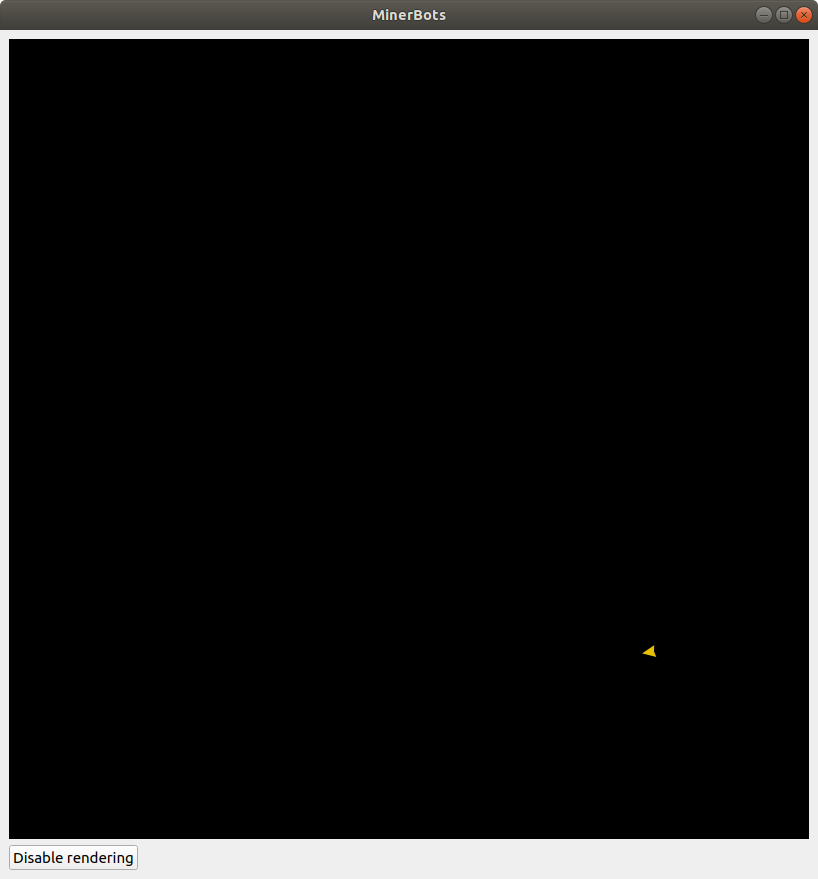
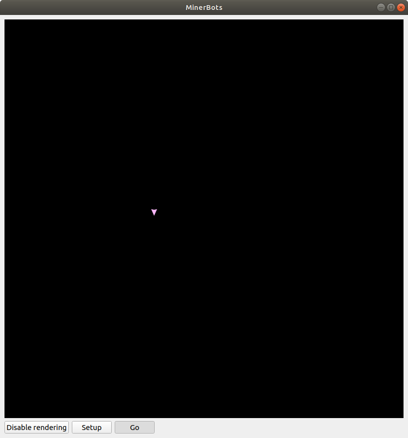
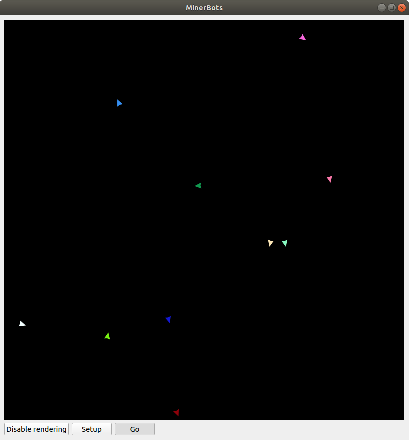
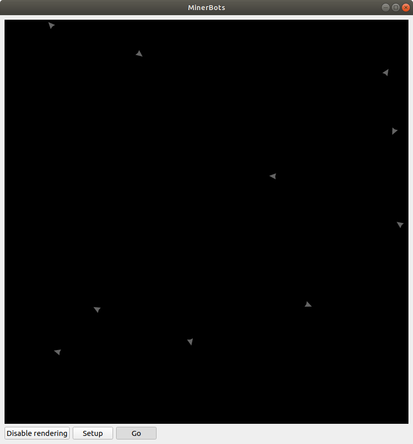
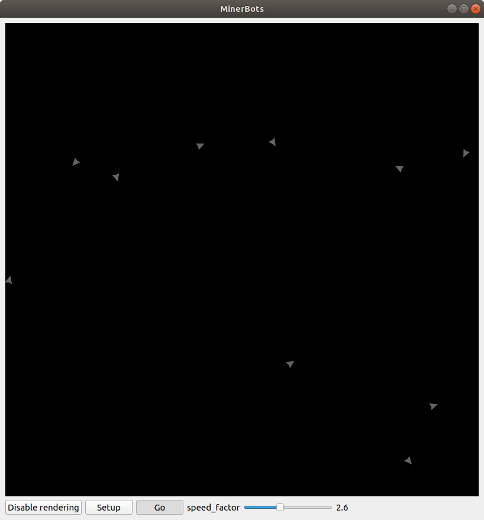
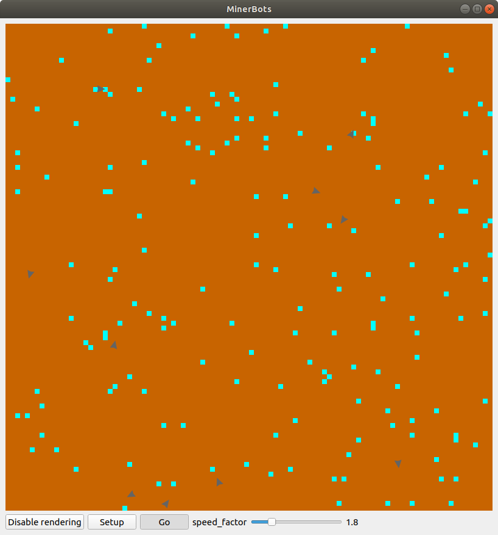
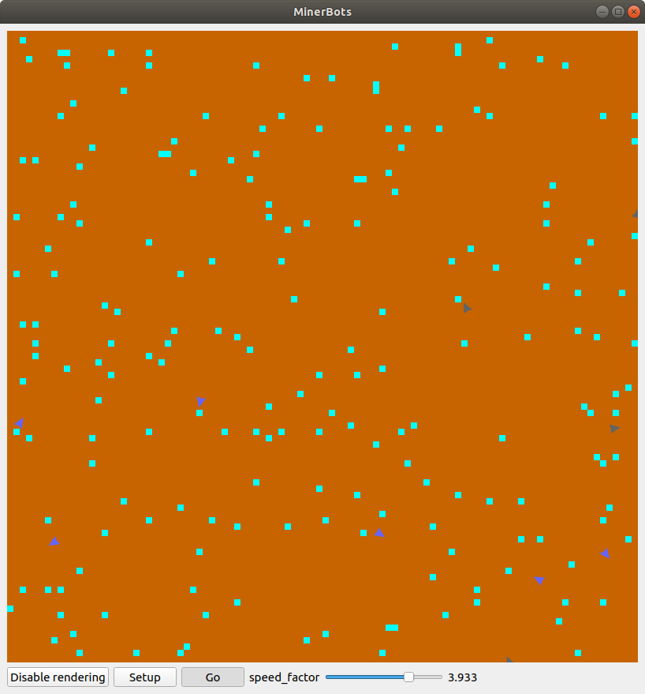
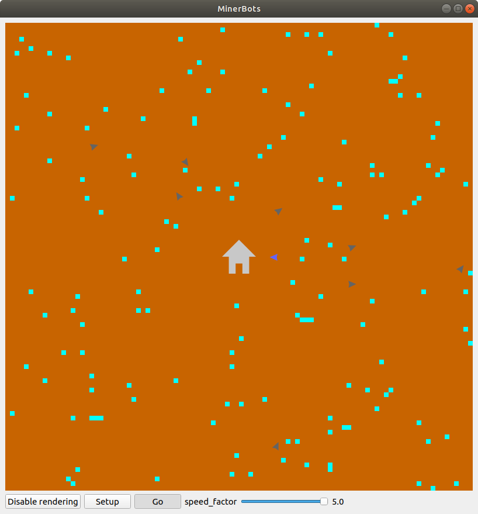
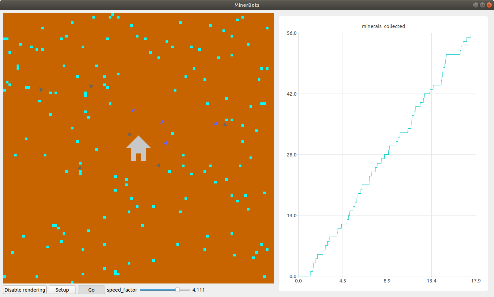
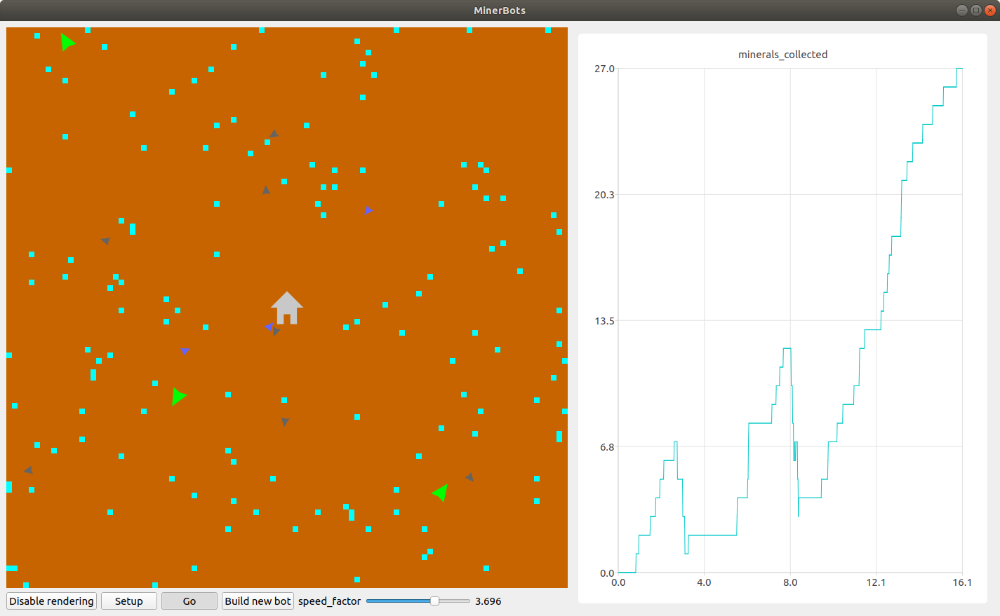

Tutorial - Miner Bots
=====================

This tutorial intends to showcase some of the functionalities provided by the ``AgentsPy`` library.

We will develop a simulation consisting of miner robots on a remote planet collecting resources and avoiding hostile aliens.

Basics
------
Begin by creating a file called ``minerbots.py``. Then, in the top of the file, import the library by writing:
::

   from agents import *

Now we can create a model. Do this by writing:
::

   miner_model = Model("MinerBots", 100, 100)

This creates a model named ``miner_model``, and gives it a size of 100 x 100 tiles.

To run the model, simply add the line:
::

   run(miner_model)

This line should generally be the last one in your file.

Running the python file, you should see a window with a black square and the name "MinerBots".

.. image:: images/minerbots/01-basics.png
   :height: 400

The first agent
---------------
Since we will be doing agent-based modelling, it is only natural that we add some *agents* to our model. For starters, we will add just one agent when we setup the simulation. Add this code somewhere between creating the model and running the model:
::

   miner_model.add_agent(Agent())

This creates an agent and adds it to the model.

Starting the simulation, you should see an agent appear in the simulation area.

Setup
-----
While we add functionality to our model, we will also add a bit of UI that makes it easier to control the flow of the simulation. First, we want to make starting and restarting the model simple, so we will create a **Setup** button. Start out by creating a function, also named ``setup``, and give it the following contents:
::

   def setup(model):
       model.reset()
       model.add_agent(Agent())

``model.reset()`` simply resets the model by removing all existing agents, and resetting all tiles. Since we would also like to generate our agents during setup, we have added a call to ``add_agent()`` to generate an agent, which means that you should now remove the line ``miner_model.add_agent(Agent())`` outside the ``setup`` function.

Add the following line after creating the model, but before running it:
::

   miner_model.add_button("Setup", setup)

Running the program, the model should now show a button labelled *"Setup"*.

Step
----
Creating agents is good, but they should also *do* something, like move around or interact with each other. To make the agents do something (and stop them from doing that same thing), we will add a *toggleable* button, which, when active, will constantly run a function that affects our agents.

To start with, create the following **Step** function:
::

   def step(model):
       for ag in model.agents:
           ag.forward()

This function simply takes all agents in our given model (currently there is only one agent in the model, but it doesn't matter) and moves them forward.

We can join it to a toggleable button in the same manner as **Setup** by adding:
::

   miner_model.add_toggle_button("Go", step)

Running the program and pressing the button, you should now see the agent move around.

More and better agents
----------------------
Let us add a few more agents to the model, just to see how it is done.

Replace the ``setup`` function with this:
::

   def setup(model):
       model.reset()
       for x in range(10):
           model.add_agent(Agent())

This will add 10 agents rather than 1.

We will also make their movement a bit more sophisticated. To start, at the top of the file, add:
::

   from random import randint

Then, in the ``step`` function, add
::

   ag.direction += randint(0, 20) - 10

inside the loop over the agents. This will make each agent randomly adjust their direction with up to 10 degrees each step.

From agents to robots
---------------------
Right now, the behavior of the agents is specified in the ``step`` function. However, we want to eventually have a few different types of agents with different behaviours, so it would make more sense that each agent iself knew how it should behave.

Rather than having all agents be of the class ``Agent``, we will create *subclasses* for each type of agent, of which all should inherit from the ``Agent`` class.

Start by creating a ``Robot`` class, which looks like this:
::

   class Robot(Agent):
       def setup(self, model):
           self.color = (100, 100, 100)
           self.direction = random.randint(0, 359)

       def step(self, model):
           self.direction += randint(0, 20) - 10
           self.forward()

``Robot.setup`` is run automatically when the agent is added to the model, so we do not need to worry about calling it. However, we do need to add robots instead of agents to the model, so replace the ``setup`` function (*not* ``Robot.setup``) with this one:
::

   def setup(model):
       model.reset()
       for x in range(10):
           model.add_agent(Robot())

``Robot.step`` is very similar to ``step``, so we can now replace ``step`` (*not* ``Robot.step``) with:
::

   step(model):
       for ag in model.agents:
           ag.step(model)

Running the model should not show any changes, but now we can make multiple types of agents, each with their own ``setup`` and ``step`` methods, without changing the "main" ``setup`` and ``step`` functions.

Adjusting parameters
--------------------
Aside from using buttons to control the agents, it is also possible to use *sliders*, which can be used to adjust the value of a given variable in the model. Let us say that we want to be able to speed up the agents by some factor. First, add the following line in ``setup``:
::

   model["speed_factor"] = 1

The model also works as a *dictionary*, where *keys* (here ``speed_factor``) can be assigned *values* (here ``1``). In ``Robot.step``, add the following line:
::

   self.speed = model["speed_factor"]

Now, just below the code where you add the buttons to the model, add this line:
::

   miner_model.add_slider("speed_factor", 1, 5, 1)

This will add an adjustible slider to the model. Starting up the model, you should be able to adjust the speed of the robots by moving the slider back and forth.

Tiles
-----
A model generally consists of two types of elements: agents and tiles. It might not seem like we have any tiles now, but they are actually already part of the model; they are just all colored black and have no code.

We will use tiles to represent the surface of our "planet". We want to make most tiles empty ground (red-brown), but some tiles should contain mineral deposits (light blue). By inserting the following code in the ``setup`` function, we can generate our tiles:
::

   for t in model.tiles:
       if randint(0, 50) == 50:
           t.color = (0, 255, 255)
           t.info["has_mineral"] = True
       else:
           t.color = (200, 100, 0)
           t.info["has_mineral"] = False

The ``randint`` function makes it so that each tile has a 1/50 chance of being a mineral deposit. The ``info`` property of the tile is also a dictionary in the same manner as the model, so each tile can have its own set of key-value pairs.

The model should now show a red-brown landscape with light blue mineral deposits scattered around it.

Doing some mining
-----------------
The robots are supposed to be *mining* robots, so let us give them some code for mining the mineral deposits.

Given that the robots are relatively small, they should only be able to mine one deposit before having a full load and being unable to mine more. We will indicate whether the robots have a full load by giving them a field ``loaded``. Add this code to ``Robot.setup``:
::

   self.loaded = False

And add this code to ``Robot.step``:
::

   t = self.current_tile()
   if t.info["has_mineral"] and not self.loaded:
       t.info["has_mineral"] = False
       t.color = (200, 100, 0)
       self.color = (100, 100, 255)
       self.loaded = True

This code inspects the tile that the robot is standing on, and, if the tile contains minerals *and* the robot is not already carrying minerals:

1. Remove the minerals from the tile.
2. Recolor the tile appropriately.
3. Update ``self.loaded`` to indicate that the robot is carrying minerals.
4. Recolor the robot (to show that it is loaded).

Robot headquarters
------------------
Since the robots can only store one mineral load before being fully loaded, we should also give them a place where they can drop off their minerals. To do this, we will have to add another agent type.

Create a ``Homebase`` class, which inherits from ``Agent``, and looks like this:
::

   class Homebase(Agent):
       def setup(self, model):
           self.size = 20
	   self.color = (200, 200, 200)
	   self.shape = AgentShape.HOUSE
	   self.x = model.width/2
	   self.y = model.height/2

       def step(self, model):
           for a in self.agents_nearby(self.size/2+5):
               if type(a) == Robot and a.loaded:
                   a.loaded = False
		   a.color = (100, 100, 100)
		   self.size += 1

This will make a light-gray circle in the center of the simulation area. In each step, the base will check if there is any loaded ``Robot`` agents nearby, and if there is, take their mineral deposit and grow a bit in size.

Since the base is supposed to be the robot headquarters, we should make the robots start in the base as well. Add these lines to ``Robot.setup``:
::

   self.x = model.width/2
   self.y = model.height/2

To improve efficiency, we will have the robots return "home" whenever they pick up minerals. In ``Robot.step``, replace
::

   self.direction += randint(0, 20)-10

with
::

   if self.loaded:
       self.point_towards(model.width/2, model.height/2)
   else:
       self.direction += randint(0, 20)-10

Finally, add a single ``Homebase`` to the model by inserting:
::

   model.add_agent(Homebase())

into the ``setup`` function where the robots are also created.

Graphs
------
The **AgentsPy** library also permits drawing trend plots of given variables in the model. We will now add a graph that shows the collection of minerals over time.

Add the following code to the ``setup`` function:
::

   model.clear_plots()
   model["minerals_collected"] = 0

The model also works as a dictionary, so we can store key-value pairs in it (in this case, ``minerals_collected``).

Now, update ``Homebase.step`` such that it correctly updates ``minerals_collected``:
::

   def step(self,model):
       for a in self.agents_nearby(self.size/2+5):
           if type(a) == Robot and a.loaded:
               a.loaded = False
               a.color = (100,100,100)
               self.size += 1
               model["minerals_collected"] += 1

Now that we have a measurable variable, we can make a graph that shows its change over time. What remains is to add this code to the ``step`` function:
::

   model.update_plots()

This indicates that whenever the model "steps", the graph should be updated.

Finally, add the actual graph by using:
::

   miner_model.line_chart("minerals_collected",(0,255,255))

More agent interaction
----------------------
To add a bit of excitement, we will add some hostile aliens, which will try to catch and destroy the robots.

Start by adding a new ``Alien`` class, which inherits from ``Agent`` and has the following contents:
::

   class Alien(Agent):
       def setup(self, model):
           self.size = 15
	   self.direction = randint(0,359)
	   self.color = (0,255,0)

       def destroy_robots(self):
           for t in self.neighbor_tiles():
               for other in t.get_agents():
	           if type(other) == Robot:
	               other.destroy()

       def step(self, model):
           self.speed = 1.5 * model["speed_factor"]
	   self.direction += randint(0, 20) - 10
	   self.forward()
           self.destroy_robots()

The aliens will be larger and greener than the robots. Each step, they will change their direction a little bit, move forward, and then destroy any robots on nearby tiles.

Now, add three aliens in the same manner as with the robots (in the ``setup`` function):
::

   for x in range(3):
       miner_model.add_agent(Alien())

To make it a bit more fair for the robots, let us make it possible to spend some of the gathered resources in exchange for creating a new robot at the homebase.

First, replace this line in ``setup``
::

   model.add_agent(Homebase())

with these lines
::

   model["Homebase"] = Homebase()
   model.add_agent(model["Homebase"])

This might seem a bit arbitrary, but by doing this, we can always obtain a reference to the homebase by using ``model["Homebase"]``.

Now, create a function ``build_bot``:
::

   def build_bot(model):
       if model["Homebase"].size > 22:
           model["Homebase"].size -= 2
           model["minerals_collected"] -= 2
           model.add_agent(Robot())

and then add a button which runs the function:
::

   miner_model.add_button("Build new bot", build_bot)

If the base is large enough, we can press the button to shrink it a bit and "spend" the materials on building a new robot.

Further work
------------
If you want to work more on the MinerBots-model, here are some changes you could try to implement:

* If an alien notices a robot close to it, it moves towards the robot.

* If a robot notices a mineral deposit close to it, and it does not already have a deposit loaded up, it moves towards the mineral deposit.

* If an alien destroys enough robots, it splits into two aliens.

* Robots that are destroyed while carrying mineral deposits drop their deposit unto their current tile.

* The model stops when all minerals are collected (use ``Model.pause()``).
