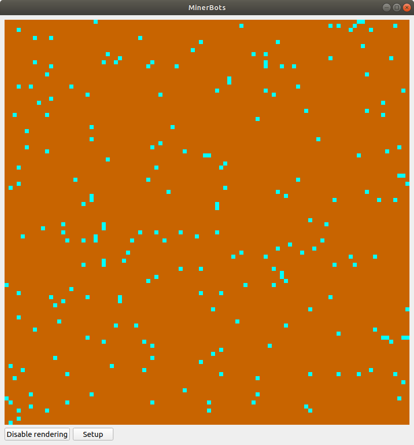
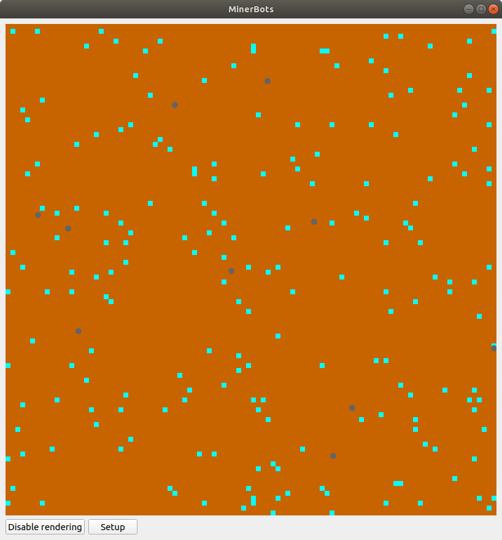
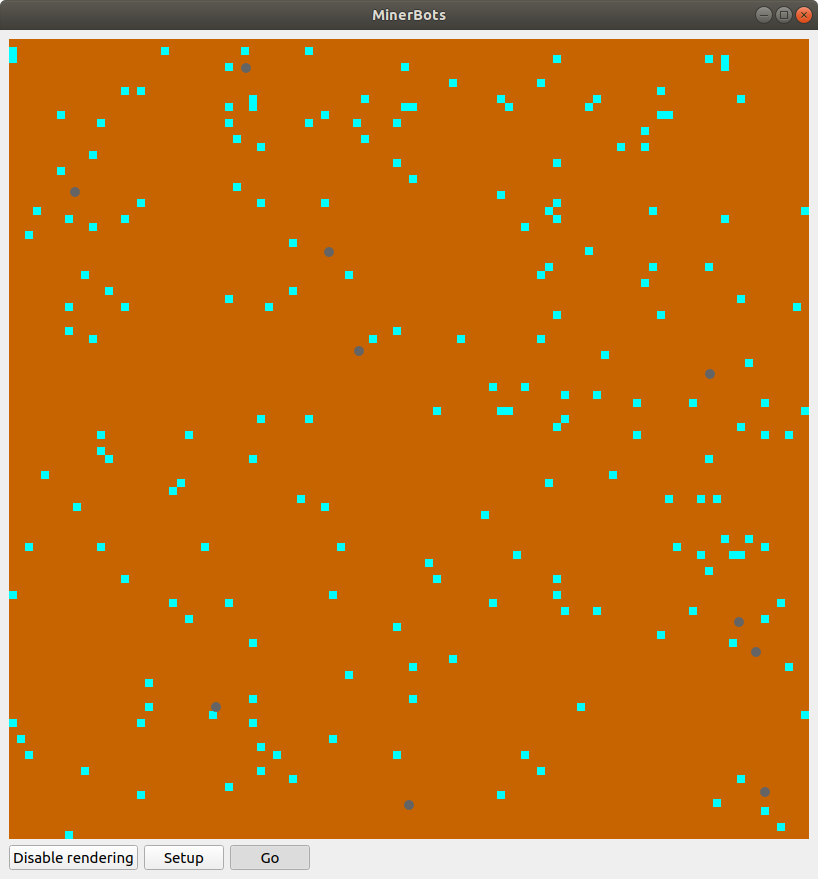
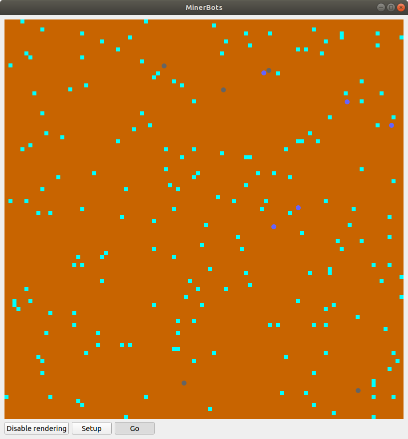
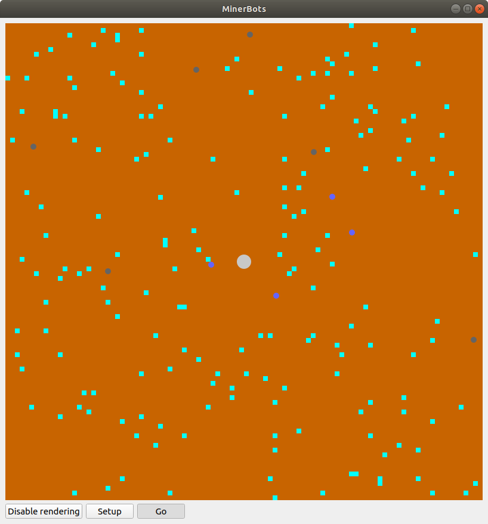

Tutorial
========

This tutorial intends to showcase some of the functionalities provided by the ``AgentsPy`` library.

We will develop a simulation consisting of miner robots on a remote planet collecting resources and avoiding hostile aliens.

Basics
------
Begin by creating a file called ``minerbots.py``. Then, in the top of the file, import the library by writing:
::

   from agents import *

Now we can create a model. Do this by writing:
::

   miner_model = Model("MinerBots", 100, 100)

This creates a model named ``miner_model``, and gives it a size of 100 x 100 tiles.

To run the model, simply add the line:
::

   run(miner_model)

This line should generally be the last one in your file.

Running the python file, you should see a window with a black square and the name "MinerBots".

Setup
-----
While we add functionality to our model, we will also add a bit of UI that makes it easier to control the flow of the simulation. First, we want to make starting and restarting the model simple, so we will create a **Setup** button. Start out by creating a function, also named ``setup``, and give it the following contents:
::

   def setup(model):
       model.reset()

``model.reset()`` simply resets the model by removing all existing agents, and resetting all tiles. Add the following line afterwards:
::

   miner_model.add_button("Setup", setup)

Running the program, the model should now show a button labelled *"Setup"*.

Tiles
-----
We will generate the tiles for the model first, which will make up the surface of our "planet". We want to make most tiles empty ground (red-brown), but some tiles should contain mineral deposits (light blue). To decide which tiles should be what, we will use a *random number generator*. Add this code to the top of your file, along with your ``agents`` import:
::

   from random import randint

By inserting the following code in the ``setup`` function, we can generate our tiles:
::

   for t in model.tiles:
       if randint(0, 50) == 50:
           t.color = (0, 255, 255)
           t.info["has_mineral"] = True
       else:
           t.color = (200, 100, 0)
           t.info["has_mineral"] = False

``randint(a,b)`` is a function from ``random`` which provides a random number between and including ``a`` and ``b``. ``t.info`` is a dictionary; each tile has their own distinct one.

Running the program and clicking the *Setup* button, the window should now display a red-brown background with light-blue squares scattered around.

The first robots
----------------
The model is not very interesting without *agents*, so we will add some now.

To begin with, create a class ``Minerbot`` which derives from ``Agent``. Give it a method ``Minerbot.setup``, which has the following contents:
::

   def setup(self, model):
      self.size = 10
      self.color = (100, 100, 100)

The ``setup`` function is unique in the way that it is run automatically whenever the agent is added to the model.

We can now add 10 robots to the model, by inserting the following code in the ``setup`` function (*not* the ``Minerbot.setup`` function):
::

   bots = set([Minerbot() for _ in range(10)])
   miner_model.add_agents(bots)

The simulation should now show 10 grey circles scattered around the landscape.

Better robots
-------------
Right now, the robots are not particularly interesting, as they are just sitting around. We will start by giving them some movement. Start by adding the following line in ``Minerbot.setup``:
::

   self.direction = randint(0, 359)

This will point the robots in a random direction when they are created.

Like the ``Minerbot.setup`` method, create a ``Minerbot.step`` method, and give it the following contents:
::

   def step(self, model):
      self.forward()

This will make the agents move forward by 1 unit whenever ``Minerbot.step`` is called.

Now, create a ``step`` function (as with the ``setup`` function):
::

   def step(model):
       for a in model.agents:
           a.step(model)

Finally, as with the *Setup* button, add a *Go* button, which, when pressed, will continously call the ``setup`` function:
::

   miner_model.add_toggle_button("Go", step)

Running the simulation and pressing the *Go* button, you should now see the robots moving around.

Even better robots
------------------
Let us make the robots' movement a bit more interesting. Add this code to the ``Minerbots.step`` method:
::

   self.direction += randint(0, 20)-10

This will make the robots vary their movement a bit when scuttling around.

Despite their name ``Minerbots``, the robots are not actually doing any mining. Let's fix that by allowing the robots to pick up minerals from a mineral deposit, if they are not already carrying a load.

To ``Minerbots.setup``, add:
::

   self.loaded = False

We will use this variable to indicate whether or not the robot is carrying minerals already.

Now, add this code to ``Minerbots.step``:
::

   t = self.current_tile()
   if t.info["has_mineral"] and not self.loaded:
       t.info["has_mineral"] = False
       t.color = (200, 100, 0)
       self.color = (100, 100, 255)
       self.loaded = True

This code inspects the tile that the robot is standing on, and, if the tile contains minerals *and* the robot is not already carrying minerals:

1. Remove the minerals from the tile
2. Recolor the tile appropriately
3. Update ``self.loaded`` to indicate that the robot is carrying minerals.
4. Recolor the robot (to show that it is loaded)

The simulation should now show the robots moving around randomly, picking up minerals they come across.

More agent types
----------------
Since the robots can pick up minerals now, it is only fair to provide a spot where they can drop them off as well.

We will add a new class deriving from ``Agent``, called ``Homebase``. It should be a larger grey circle in the middle of the simulation area, representing the main base of the robots. Give it the following ``Homebase.setup`` method:
::

   def setup(self, model):
       self.size = 20
       self.color = (200, 200, 200)
       self.x = model.width/2
       self.y = model.height/2

Since the base is supposed to be the robot headquarters, we should make the robots start in the base as well. Add these lines to ``Minerbot.setup``:
::

   self.x = model.width/2
   self.y = model.height/2

To make it possible for robots to drop off minerals, create a ``Homebase.step`` function with the following properties:
::

   def step(self, model):
       for a in self.agents_nearby(self.size+5):
           if type(a) == Minerbot and a.loaded:
               a.loaded = False
               a.color = (100, 100, 100)
               self.size += 1

The function checks, for each nearby agent, if it is a ``Minerbot`` and has a load of minerals, in which case, it updates the ``Minerbot`` to its default look and setting (no load), and grows a bit in size.

To improve efficiency, we will have the robots return "home" whenever they pick up minerals. In ``Minerbot.step``, replace
::

   self.direction += randint(0, 20)-10

with
::

   if self.loaded:
       self.point_towards(model.width/2, model.height/2)
   else:
       self.direction += randint(0, 20)-10

Finally, add a single ``Homebase`` to the model by inserting:
::

   model.add_agent(Homebase())

into the ``step`` function where the robots are also created.

Graphs
------
The **AgentsPy** library also permits drawing trend plots of given variables in the model. We will now add a graph that shows the collection of minerals over time.

Add the following code to the ``setup`` function:
::

   model.clear_plots()
   model["minerals_collected"] = 0

The model also works as a dictionary, so we can store key-value pairs in it (in this case, ``minerals_collected``).

Now, update ``Homebase.step`` such that it correctly updates ``minerals_collected``:
::

   def step(self,model):
       for a in self.agents_nearby(self.size/2+5):
           if type(a) == Minerbot and a.loaded:
               a.loaded = False
               a.color = (100,100,100)
               self.size += 1
               model["minerals_collected"] += 1

Now that we have a measurable variable, we can make a graph that shows its change over time. What remains is to add this code to the ``step`` function:
::

   model.update_plots()

This indicates that whenever the model "steps", the graph should be updated.

Finally, add the actual graph by using:
::

   miner_model.graph("minerals_collected",(0,255,255))

More agent interaction
----------------------
To add a bit of excitement, we will add some hostile aliens, which will try to catch and destroy the robots.

Start by adding a new ``Alien`` class, inheriting from ``Agent``. Give it the following ``Alien.setup`` method:
::

   def setup(self, model):
       self.size = 15
       self.direction = randint(0,359)
       self.color = (0,255,0)

Add another method, ``Alien.destroy_robots``, with the following contents:
::

   def destroy_robots(self):
       for t in self.neighbor_tiles():
           for other in t.get_agents():
	       if type(other) == Minerbot:
	           other.destroy()

This will have the alien destroy any robots located on its own tile or any neighboring tiles.

Now, add the method ``Alien.step``:
::

   def step(self, model):
       self.destroy_robots()
       self.forward()

Finally, add three aliens in the same manner as with the robots (in the ``setup`` function):
::

   aliens = set([Alien() for _ in range(3)])
   miner_model.add_agents(aliens)

Robot control
-------------
We will now make the model a bit more interactive. It should be possible for the base to produce a new robot, but then in exchange lose a bit of size.

First, replace this line in ``setup``
::

   model.add_agent(Homebase())

with this one
::

   model["Homebase"] = Homebase()
   model.add_agent(model["Homebase"])

By doing this, we can always obtain a reference to the homebase by using ``model["Homebase"]``.

Now, create a function ``build_bot``:
::

   def build_bot(model):
       if model["Homebase"].size > 30:
           model["Homebase"].size -= 10:
	   model.add_agent(Minerbot())

and then add a button which runs the function:
::

   miner_model.add_button("Build new bot", build_bot)

For even more control, we will make it possible to speed up the robots.

In ``setup``, add:
::

   model["robot_speed"] = 2

In the first line of ``Minerbot.step``, add:
::

   self.speed = model["robot_speed"]

Finally, add a *slider* which can adjust the value of ``robot_speed``:
::

   miner_model.add_slider("robot_speed", 1, 5, 2)

with 1 being the minimum speed, 5 the maximum, and 2 the initial.
